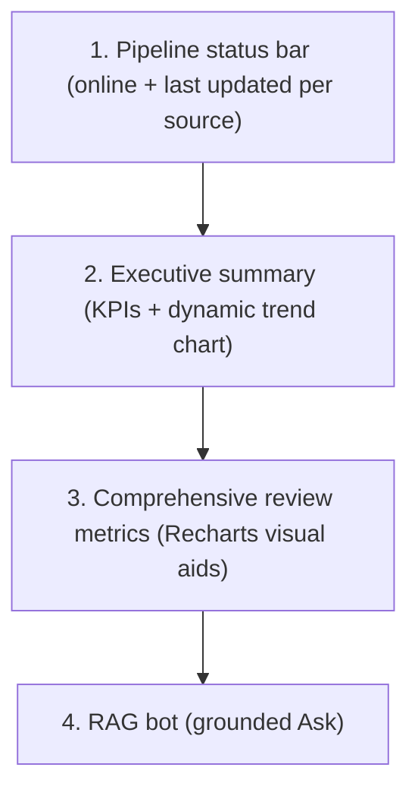
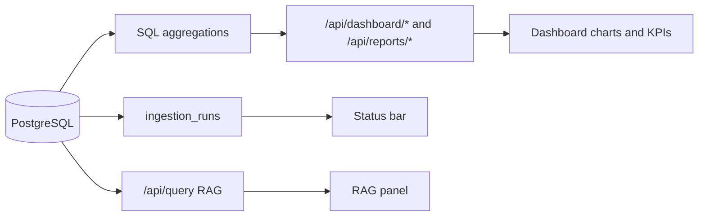

# UI Design Spec — Voice of Customer Intelligence (Spotify Dark)

This is the single source of truth for how the front end should look and behave. Edit this file to tell the build exactly what you want; the implementation must follow it.

- **Theme:** Dark, matching Spotify.
- **Charts:** Recharts (`ResponsiveContainer` for all charts).
- **Targets:** Mobile + web (responsive).
- **Motion:** Smooth, subtle, respects reduced-motion.

> Status of this doc: finalized. Design tokens captured from the provided Spotify design-system screenshots; all open decisions resolved (font = SF Pro, brand logos in `public/brand/`). See [Open Items / Decisions](#open-items--decisions).

---

## 1. Brand & Logo

| Asset | File | Use |
|-------|------|-----|
| App icon (green glyph on black) | `public/brand/spotify-app-icon.png` | Header/sidebar mark, favicon, mobile bottom-nav brand |
| Wordmark (green "Spotify") | `public/brand/spotify-wordmark.png` | Landing/login, large headers |

 

Rules:
- Brand files live in `public/brand/` (PNG provided). If a vector `.svg` becomes available, drop it in alongside and prefer it for crisp scaling.
- Clear space around the icon >= 25% of its height. Minimum icon size 24px.
- Never recolour the glyph; on dark surfaces use the green-on-transparent glyph.
- The product name shown beside the mark: **"Voice of Customer"** (Spotify is the subject of analysis, not the brand owner — keep a visible "Unofficial / analysis project" disclaimer in the footer).

---

## 2. Colour Tokens

Dark theme only. Defined as CSS custom properties on `:root`. Base background is Spotify black; greys are **white at opacity** layered on black.

### Primary
| Token | Value | Use |
|-------|-------|-----|
| `--color-green` | `#1ED760` | Primary actions, positive sentiment, brand accent, focus |
| `--color-white` | `#FFFFFF` | Primary text on dark |
| `--color-black` | `#191414` | App background base |

### Decorative (chart series & accents)
| Token | Value | Name |
|-------|-------|------|
| `--color-blue-moon` | `#649AED` | Blue Moon |
| `--color-red-wine` | `#EB5540` | Red Red Wine |
| `--color-mellow-yellow` | `#F6CE74` | Mellow Yellow |
| `--color-pale` | `#A7C3D1` | Whiter Shade of Pale |
| `--color-evergreen` | `#ADF479` | Evergreen |
| `--color-pretty-pink` | `#F7CFD4` | Pretty in Pink |
| `--color-pink-moon` | `#E578A1` | Pink Moon |
| `--color-yellow-sub` | `#F4E357` | Yellow Submarine |

### UI Greys (white @ opacity on black)
| Token | Opacity | Typical use |
|-------|---------|-------------|
| `--grey-0` | white 4% | Hairline fills, hover wash |
| `--grey-1` | white 8% | Card surface |
| `--grey-2` | white 12% | Borders, dividers |
| `--grey-3` | white 20% | Strong borders, disabled fill |
| `--grey-4` | white 30% | Disabled text |
| `--grey-5` | white 46% | Secondary/muted text |
| `--grey-6` | white 60% | Tertiary text, captions |

### Semantic mapping
| Semantic | Token |
|----------|-------|
| Background base | `--color-black` |
| Surface / card | `--grey-1` over black |
| Elevated surface | `--grey-2` over black |
| Border / divider | `--grey-2` / `--grey-3` |
| Text primary | `--color-white` |
| Text secondary | `--grey-5` |
| Text tertiary | `--grey-6` |
| Positive / success / online | `--color-green` |
| Negative / error / offline | `--color-red-wine` |
| Neutral | `--grey-5` |
| Warning / stale | `--color-mellow-yellow` |

### Chart series order (default)
green → blue-moon → mellow-yellow → pink-moon → pale → evergreen → red-wine → yellow-sub. Sentiment-specific: positive = green, neutral = grey-5, negative = red-wine, mixed = mellow-yellow.

---

## 3. Typography

Spotify's "Circular" is proprietary. **Confirmed: use SF Pro** (Apple's system family) as the primary typeface, with platform fallbacks:

```
--font-sans: -apple-system, "SF Pro Display", "SF Pro Text", Roboto,
             "Noto Sans", system-ui, "Segoe UI", sans-serif;
```

> SF Pro renders natively on Apple devices/browsers; the fallbacks keep parity on Android/Windows. "Display" variant for headings (>= 1.25rem), "Text" for body.

Scale (rem @ 16px base). Default text colour white; secondary uses `--grey-5`.

| Style | Size | Weight | Line-height | Use |
|-------|------|--------|-------------|-----|
| Heading 1 | 2.5 | 700 | 1.1 | Page hero |
| Heading 2 | 2.0 | 700 | 1.15 | Section title |
| Heading 3 | 1.5 | 700 | 1.2 | Card group title |
| Heading 4 | 1.25 | 600 | 1.25 | Card title |
| Heading 5 | 1.125 | 600 | 1.3 | Sub-card |
| Heading 6 | 1.0 | 600 | 1.4 | Eyebrow |
| Title 1 | 1.375 | 700 | 1.25 | KPI heading |
| Title 2 | 1.125 | 600 | 1.3 | KPI sub |
| Subtitle | 1.0 | 500 | 1.4 | Supporting |
| Lead | 1.125 | 400 | 1.5 | Intro paragraph |
| Body 1 | 1.0 | 400 | 1.5 | Default body |
| Body 1 Strong | 1.0 | 600 | 1.5 | Emphasis |
| Body 2 | 0.875 | 400 | 1.5 | Dense body, table |
| Body 2 Strong | 0.875 | 600 | 1.5 | Emphasis |
| Body 3 | 0.8125 | 400 | 1.45 | Meta |
| Body 3 Strong | 0.8125 | 600 | 1.45 | Meta emphasis |
| Small | 0.75 | 400 | 1.4 | Captions, badges |
| Small Strong | 0.75 | 600 | 1.4 | Caption emphasis |

Numerals in KPIs/charts use `font-variant-numeric: tabular-nums`.

---

## 4. Spacing, Radius, Elevation

- **Spacing scale (4px base):** `4, 8, 12, 16, 20, 24, 32, 40, 48, 64`. Tokens `--space-1..--space-10`.
- **Radius:** `--radius-pill: 999px` (buttons/pills), `--radius-card: 12px`, `--radius-sm: 8px`, `--radius-xs: 4px`.
- **Elevation (shadows on black):**
  - `--elev-1`: `0 1px 2px rgba(0,0,0,.4)`
  - `--elev-2`: `0 4px 16px rgba(0,0,0,.5)`
  - `--elev-3`: `0 12px 32px rgba(0,0,0,.6)` (modals, popovers)
- **Layout:** max content width `1200px`; sidebar width `240px` (desktop), collapses on mobile. Gutter `--space-6` desktop, `--space-4` mobile.

---

## 5. Motion & Animation

- **Durations:** `--motion-fast: 120ms`, `--motion-base: 200ms`, `--motion-slow: 320ms`.
- **Easing:** `--ease-standard: cubic-bezier(0.4, 0, 0.2, 1)`; `--ease-emphasis: cubic-bezier(0.2, 0, 0, 1)`.
- **Patterns:**
  - Buttons/pills: hover `scale(1.03)` + brightness lift; press `scale(0.97)`; `--motion-fast`.
  - Cards: mount fade + slide-up (8px) with 30–50ms stagger; `--motion-base`.
  - Charts: animate on mount (Recharts `isAnimationActive`), `--motion-slow`, ease-emphasis.
  - Nav/route change: cross-fade content `--motion-base`.
  - Status dot (online): subtle pulse (2s loop).
  - Skeletons: shimmer 1.2s loop.
- **Reduced motion:** under `@media (prefers-reduced-motion: reduce)` disable transforms/shimmer/chart animation; keep instant state changes.

---

## 6. Components

### Buttons (from Buttons screenshot)
| Component | Look | States |
|-----------|------|--------|
| PrimaryButton | Green pill, black label, bold | hover lift, press shrink, disabled = `--grey-3` fill / `--grey-4` text |
| SecondaryButton | Transparent, `--grey-3` border pill, white label; optional leading icon | hover border→white + `--grey-0` wash |
| TextButton | No bg/border, white label, green on hover | underline optional |
| NavigationButton | Circular 40px, `--grey-2` fill, chevron icon | hover `--grey-3`; disabled dimmed |
| ActionButton | Circular icon button (play/pause/skip/shuffle/repeat/etc.) | active state uses green icon |
| Pill / Toggle | Small pill; selected = white fill/black text, unselected = `--grey-2` fill/white text | used for filters ("All", "Playlists", source toggles) |

Min touch target 44px on mobile. Focus ring: 2px `--color-green` offset 2px.

### Navigation (from Navigation screenshot)
- **Left NavigationMenu (desktop):** brand mark; primary links **Dashboard, Reports, Explore, Ask**; secondary section (e.g., source quick-filters); item = icon + label, active = white text + `--grey-1` fill + 3px green left indicator.
- **Header:** NavigationButtons (`<` `>`), search input (rounded, `--grey-2` fill, clear "x"), user menu (avatar + name + chevron dropdown).
- **Mobile:** sidebar collapses to a bottom tab bar (Dashboard / Reports / Explore / Ask) with icons; header reduces to brand + search icon + avatar; hamburger opens the full menu as a slide-in drawer.

### Surfaces
- **Card:** `--grey-1` surface, `--grey-2` border, `--radius-card`, padding `--space-5`/`--space-6`, `--elev-1`.
- **StatCard / KPI:** label (Small, `--grey-5`), value (Title 1, tabular-nums), delta chip (green ▲ / red ▼ vs previous period).
- **DataTable:** header `--grey-5`, row divider `--grey-2`, row hover `--grey-0`, Body 2.
- **Badge / Pill chip:** Small text, `--grey-2` fill, pill radius; semantic variants recolour.
- **Quote block:** italic Body 1, left green accent border, meta line (source • author • date) in Small `--grey-5`.
- **Chart container:** card with title (Heading 5), optional legend, `ResponsiveContainer`; tooltips dark (`--grey-2` bg, white text).

### Icons (from Icons screenshot)
- Line style, ~1.5px stroke, `currentColor`, sizes 16/20/24. Default `--grey-5`, active white/green.
- Set: Spotify-native (play, pause, skip, shuffle, repeat, heart, share, podcast, volume, etc.) + similar-style additional (search, home, library, calendar, chart, filter, chevrons, etc.). Use one consistent line-icon library (e.g., Lucide/Feather) configured to match.

---

## 7. Responsive

| Breakpoint | Range | Layout |
|------------|-------|--------|
| Mobile | <= 640px | Single column; bottom tab nav; charts full-width stacked; KPIs 2-up grid |
| Tablet | 641–1024px | Collapsible sidebar; 2-column card grid; KPIs 2–3-up |
| Desktop | > 1024px | Fixed 240px sidebar; 12-col content grid; KPIs 4-up; multi-chart rows |

- All charts use Recharts `ResponsiveContainer` (100% width, fixed/min height).
- Grids reflow with CSS grid `auto-fit minmax`.
- Touch targets >= 44px on mobile; hover-only affordances have tap equivalents.

---

## 8. States & Accessibility

- **Loading:** skeleton shimmer for cards/charts/tables; never layout-shift.
- **Empty:** friendly message + primary action (e.g., "No reviews yet — run ingestion").
- **Error:** inline error card with retry; pipeline-down handled on dashboard status bar.
- **A11y:** WCAG AA contrast (white/`--grey-5` on black pass); visible focus rings; charts have accessible text summaries / aria-labels and a data-table fallback; all interactive elements keyboard reachable; respects reduced-motion.

---

## 9. Main Dashboard (`/dashboard`) — Layout Spec

The dashboard is the **main landing**. It is a comprehensive, data-backed Spotify review analysis report plus a RAG bot. All numbers are computed in SQL; the LLM never fabricates metrics.



### Section 1 — Pipeline status bar
- Per-source health chips: **App Store**, **Play Store** (Pipeline 1, primary), **Kaggle** (Pipeline 2, historical).
- Each chip: status dot (green online / red offline / yellow stale), source name, relative "last updated" (e.g., "2h ago"), last run inserted count.
- Data: latest `ingestion_runs` per source/pipeline. Online = last run `completed` within freshness window (configurable; default 7 days for live, "baseline" for Kaggle).
- A global "Pipelines: Online/Degraded" summary + last refresh timestamp.

### Section 2 — Executive summary
- **KPI row (StatCards with WoW/period deltas):**
  - Total reviews (live + historical, with split)
  - Average rating (★, current period vs previous)
  - Positive / Negative / Neutral sentiment %
  - Review volume (last 7/30 days) with delta
  - Net sentiment trend arrow
- **Dynamic primary chart:** review volume over time (line/area) with avg-rating as a secondary axis OR a bar of volume — the build chooses the representation that best fits the data range (fallback to bar when sparse). Range toggle pills: 7d / 30d / 90d / All.
- One-line auto-generated **headline** (grounded summary of the biggest movement; LLM phrasing only, numbers from SQL).

### Section 3 — Comprehensive review metrics (Recharts)
| Visual | Chart | Data |
|--------|-------|------|
| Rating distribution | Bar (1–5 ★) | counts per rating |
| Sentiment over time | Stacked area / line | sentiment per day/week |
| Source mix | Donut | reviews per source (app_store/play_store/kaggle) |
| Top themes | Horizontal bar | theme frequency from `enrichment_results` |
| Pain points | Ranked list + bar | top pain_points + counts + sample quotes |
| Feature requests | Ranked list + bar | top feature_requests + counts + sample quotes |
| Volume trend | Line | reviews/day |
| Rating trend | Line | avg rating/day |
| Live vs historical | Grouped bar / dual line | live (Pipeline 1) vs Kaggle baseline (Pipeline 2) — sentiment/rating comparison to show trend shift over time |

- Each card: title, the chart, and a short caption with the key takeaway. Filters (source, sentiment, date range) apply across the dashboard.
- All metrics come from report aggregation APIs (SQL). Charts hydrate from `/api/reports/*` and dashboard-specific endpoints.

### Section 4 — RAG bot
- Grounded Ask panel reusing `/api/query`: input, example questions, structured answer (summary, key findings, supporting quotes with source attribution, recommendations). Shows "insufficient evidence" state when guardrails block. Quotes are verbatim and link back to the review.

### Dashboard data flow


---

## Open Items / Decisions

| Item | Decision |
|------|----------|
| **Font** | ✅ **SF Pro** (system family) with platform fallbacks — confirmed. |
| **Logos** | ✅ App icon + wordmark provided as PNG in `public/brand/`. Swap in `.svg` later if available. |
| **Chart accent mapping** | No preference → use the default series order in §2 (sentiment colours fixed: positive=green, neutral=grey-5, negative=red-wine, mixed=mellow-yellow). |
| **Must-have KPIs** | No preference → ship the KPI set defined in §9 Sections 2–3. |
| **Favicon / PWA icon** | No preference → derive from `spotify-app-icon.png` at build time. |

All open items are resolved; the follow-up build can proceed from this spec.

---

## Change Log
- v0.2 — Resolved open items: SF Pro confirmed, brand logos added to `public/brand/` (app icon + wordmark), chart accents/KPIs/favicon defaulted.
- v0.1 — Initial Spotify-dark design system + main dashboard spec (Recharts, mobile + web). Captured from provided design-system screenshots.
