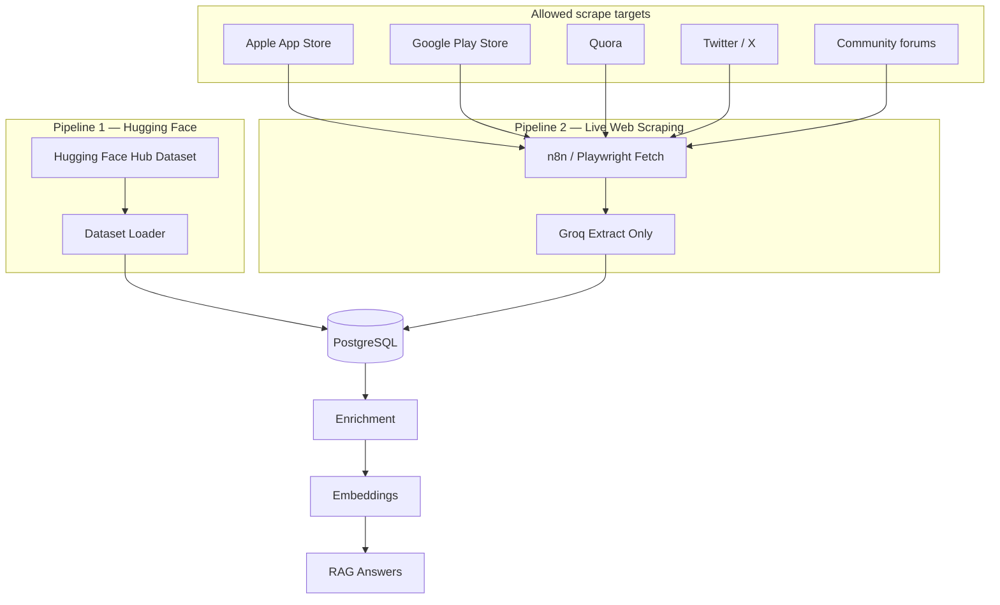

# Anti-Hallucination Guardrails

This document defines **mandatory guardrails** for the [Voice of Customer Intelligence Platform](./problemstatement.md). The bot must **never invent feedback, quotes, statistics, or recommendations**. Every output must trace back to data ingested through exactly **two allowed pipelines**.

---

## Allowed Data Pipelines (Strict — No Others)

The system may **only** ingest feedback from these two paths. No third-party APIs, manual uploads, synthetic data, or LLM-generated “sample” reviews are permitted unless explicitly added later.



| Pipeline | ID | What it covers |
|----------|-----|----------------|
| **1 — Hugging Face** | `huggingface` | Pre-built dataset from Hugging Face Hub (dataset ID **TBD — configure via `HF_DATASET_ID`**) |
| **2 — Live scrape** | `live_scrape` | Real-time fetch from the internet → Groq extraction → DB |

### Allowed platforms under live scrape

| Platform | `source` value | Notes |
|----------|----------------|-------|
| Apple App Store | `app_store` | Reviews only |
| Google Play Store | `play_store` | Reviews only |
| Quora | `quora` | Questions, answers, comments |
| Twitter / X | `twitter` | Public posts/replies where accessible |
| Community forums | `forum` | e.g. Reddit threads, product forums, discussion boards |

**Blocked at ingestion:** Any URL or platform not in the allowlist above is rejected before fetch. Any record without a valid `ingestion_pipeline` (`huggingface` \| `live_scrape`) is rejected at insert.

---

## Core Principle: Closed-World Answers

> The LLM is a **summarizer and formatter** of retrieved database rows — not a source of truth.

| Layer | LLM may | LLM must NOT |
|-------|---------|--------------|
| Groq extraction | Parse text **already on the fetched page** | Invent reviews, ratings, or authors not on the page |
| Enrichment | Label and extract from **stored `content`** | Add pain points, themes, or facts not in the text |
| RAG generation | Synthesize **retrieved rows only** | Quote, paraphrase-as-quote, or cite feedback that was not retrieved |
| Recommendations | Suggest actions **implied by retrieved pain points / feature requests** | Propose product ideas with no supporting retrieved evidence |

---

## Guardrail 1 — Ingestion (Live Scrape + Groq)

Applies to Pipeline 2. Hugging Face rows are trusted from the dataset but still validated for required fields.

### Rules

1. **Store raw fetch before Groq** — Save `metadata.raw_html` or `metadata.raw_text` for every scraped URL.
2. **Extract, don’t generate** — Groq prompt must state: *“Return only feedback verbatim or near-verbatim from the provided page. Do not invent items.”*
3. **Grounding check** — Each extracted `content` string must match the raw page (substring or fuzzy similarity ≥ 0.85). Items failing validation are **discarded**, not inserted.
4. **Allowlist URLs** — Only fetch domains/patterns configured in `SCRAPE_ALLOWLIST` (App Store, Play Store, Quora, Twitter/X, approved forum domains).
5. **Provenance required** — Every row must have: `ingestion_pipeline`, `source`, `source_id`, `source_url`, `fetched_at`.

### On failure

- Zero validated items from a URL → log `extraction_rejected`, do not insert placeholders.
- Groq returns items not on page → reject entire batch for that URL and flag for review.

---

## Guardrail 2 — Hugging Face Import

Applies to Pipeline 1.

### Rules

1. **Single configured dataset** — Only import from `HF_DATASET_ID` (set when ID is provided). Reject unknown dataset IDs at runtime.
2. **No LLM during import** — HF rows are mapped field-to-field; Groq is not used to transform or augment content on import.
3. **Required fields** — Skip rows with empty/deleted content (`[deleted]`, `[removed]`, length < 10).
4. **Tag provenance** — Set `ingestion_pipeline = huggingface`, `metadata.hf_dataset_id`, `metadata.hf_row_id`.

---

## Guardrail 3 — Enrichment

### Rules

1. **Input = stored `content` only** — No web search, no external knowledge.
2. **Prompt constraint** — *“Extract only what is explicitly stated or directly implied in the text. Do not add industry knowledge or assumptions.”*
3. **Structured output validation** — Reject enrichment if JSON schema invalid; retry once, then mark `enrichment_status = failed`.
4. **Ground pain points / feature requests** — Each extracted label should be traceable to a phrase in `content` (optional span stored in `metadata.evidence_spans`).
5. **Temperature = 0** for enrichment calls.

---

## Guardrail 4 — Retrieval (Vector Search)

### Rules

1. **Search only `feedback_items` in PostgreSQL** — No live web fetch at query time.
2. **Minimum similarity threshold** — Default `MIN_RETRIEVAL_SCORE = 0.72` (tune empirically). Results below threshold are excluded.
3. **Minimum evidence count** — RAG requires ≥ `MIN_EVIDENCE_ITEMS = 3` retrieved items above threshold, or the query is refused.
4. **Deduplicate by `content_hash`** — Avoid redundant context dominating the answer.
5. **Source filter optional** — User may filter to `app_store`, `play_store`, `quora`, `twitter`, `forum`, or `huggingface` only.

---

## Guardrail 5 — RAG Generation (Critical)

### Pre-generation checks

| Check | Action if failed |
|-------|------------------|
| Retrieved items < `MIN_EVIDENCE_ITEMS` | Return `insufficient_evidence` response (no LLM answer) |
| Max similarity < `MIN_RETRIEVAL_SCORE` | Same — refuse to generate |
| Question off-topic (not about user feedback) | Return `out_of_scope` — no LLM answer |
| Prompt injection detected in retrieved content | Strip/isolate; system prompt ignores embedded instructions |

### System prompt (mandatory constraints)

```
You are a Voice of Customer analyst. You may ONLY use the feedback items provided in <context>.
- Do NOT use outside knowledge.
- Do NOT invent quotes, user names, ratings, or statistics.
- Do NOT cite feedback IDs that are not in <context>.
- If the context is insufficient, say so — do not guess.
- Every key finding must map to at least one item in <context>.
- Product recommendations must reference specific pain points or feature requests from <context>.
```

### Post-generation validation (hard gate)

Before returning any response to the user:

1. **Quote validation** — Every string in `supporting_quotes` must match a `content` field from the retrieved set (exact or fuzzy ≥ 0.90). Invalid quotes are **removed**; if none remain, return `insufficient_evidence`.
2. **ID validation** — Every cited `feedback_item_id` must exist in the retrieved set.
3. **Count validation** — Frequency counts in `theme_breakdown` and `source_attribution` must be computed from retrieved rows in code — **not** generated by the LLM. The LLM provides themes; the backend calculates counts.
4. **Schema validation** — Response must match JSON schema; retry once on failure, else return error.
5. **Temperature = 0** for RAG generation.

### Insufficient evidence response (template)

When guardrails block generation:

```json
{
  "status": "insufficient_evidence",
  "executive_summary": "Not enough matching feedback in the database to answer this question confidently.",
  "key_findings": [],
  "supporting_quotes": [],
  "theme_breakdown": [],
  "source_attribution": [],
  "product_recommendations": [],
  "meta": {
    "retrieved_count": 0,
    "message": "All answers must come from ingested App Store, Play Store, Quora, Twitter, forum, or Hugging Face data only."
  }
}
```

---

## Guardrail 6 — Dashboard & Automated Insights

### Rules

1. **Aggregates from DB only** — Charts and counts are SQL aggregations over `feedback_items` + `enrichment_results`, never LLM-estimated numbers.
2. **Insight summaries** — LLM may narrate clusters, but cluster membership and counts come from the database.
3. **Show provenance** — Dashboard displays breakdown by `source` and `ingestion_pipeline`.
4. **Coverage indicator** — Show “Based on N ingested items” so users know data scope.

---

## Environment Variables (Guardrail Config)

| Variable | Purpose | Example |
|----------|---------|---------|
| `HF_DATASET_ID` | **TBD** — only allowed HF dataset | `(to be provided)` |
| `HF_DATASET_SPLIT` | Dataset split | `train` |
| `SCRAPE_ALLOWLIST` | Comma-separated domains/patterns | `apps.apple.com,play.google.com,quora.com,twitter.com,x.com` |
| `MIN_RETRIEVAL_SCORE` | Similarity floor for RAG | `0.72` |
| `MIN_EVIDENCE_ITEMS` | Min retrieved items to answer | `3` |
| `QUOTE_MATCH_THRESHOLD` | Fuzzy match for quote validation | `0.90` |
| `EXTRACTION_GROUNDING_THRESHOLD` | Scrape content grounding | `0.85` |
| `LLM_TEMPERATURE` | Must be `0` for enrichment + RAG | `0` |

---

## Implementation Checklist

These modules enforce guardrails in code (Phase 0–4):

- [ ] `lib/allowed-sources.ts` — Allowlist of pipelines, platforms, and scrape domains
- [ ] `lib/guardrails/extraction-validator.ts` — Ground Groq output against raw HTML
- [ ] `lib/guardrails/quote-validator.ts` — Verify RAG quotes against retrieved rows
- [ ] `lib/guardrails/evidence-gate.ts` — Block RAG if retrieval below thresholds
- [ ] `lib/guardrails/prompts.ts` — Shared closed-world system prompts
- [ ] `lib/metrics/compute-attribution.ts` — Backend-computed counts (not LLM)
- [ ] DB constraint: `ingestion_pipeline IN ('huggingface', 'live_scrape')`
- [ ] DB constraint: `source IN ('app_store', 'play_store', 'quora', 'twitter', 'forum', 'huggingface')`
- [ ] Reject inserts at API layer if pipeline or source not allowlisted

---

## What the Bot Must Never Do

1. Answer a product question when retrieval returns no qualifying evidence
2. Present a user quote that does not exist in the database
3. Invent review counts, sentiment percentages, or trend numbers
4. Pull data from the live internet during a user query (only at scheduled scrape time)
5. Import from any Hugging Face dataset other than the configured `HF_DATASET_ID`
6. Accept scraped content from domains outside `SCRAPE_ALLOWLIST`
7. Use training knowledge to fill gaps when context is incomplete

---

## Related Documents

- [Problem Statement](./problemstatement.md)
- [Phase-Wise Architecture](./phase-wise-architecture.md)
- [Edge Cases](./edge-cases.md)
