# Phase-Wise Architecture

This document defines the implementation phases for the [AI-Powered Voice of Customer Intelligence Platform](./problemstatement.md). Each phase builds on the previous one and ends with a testable milestone.

---

## High-Level Architecture

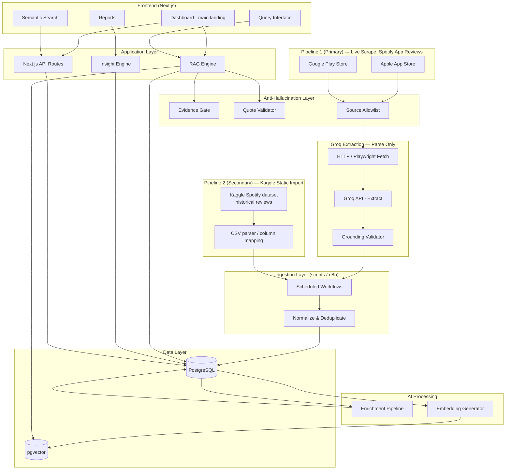

> **Data policy:** Two ingestion pipelines, both **Spotify app reviews only**:
> - **Pipeline 1 (primary)** — live scrape of the Spotify app on the Apple App Store and Google Play Store (fresh reviews; drives the dashboard).
> - **Pipeline 2 (secondary)** — Kaggle Spotify reviews dataset (`STATIC_DATASET_PATH`) for history, trend baselines, and a larger sample size.
>
> All rows carry `product_name = 'Spotify'`. App identity is pinned to the Spotify apps (`324684580`, `com.spotify.music`). Any optional future context source (forums/social) must keyword-filter to Spotify-app-review content. Full guardrail spec: [guardrails.md](./guardrails.md). UI/dashboard spec: [UI.md](../UI.md).

---

## Phase Summary

| Phase | Name | Goal | Key Deliverable |
|-------|------|------|-----------------|
| 0 | Foundation | Project scaffolding and data model | Running app + empty database |
| 1 | Data Ingestion | Live scrape (primary) + Kaggle static (secondary), Spotify only | Normalized feedback in PostgreSQL |
| 2 | AI Enrichment | Classify and tag every feedback item | Enriched records with metadata |
| **5-lite** | **Reports UI** | **Primary analysis engine (SQL-only)** | **4 in-app report pages** |
| 3 | Vector Search | Enable semantic retrieval | Working search API over embeddings |
| 4 | RAG Query Interface | Secondary ad-hoc Q&A with evidence | Ask tab + `/api/query` |
| 5-full | Insight Engine | Groq narratives on pre-computed stats | Optional report summaries |
| 6 | Extensions | Hybrid search, trend alerts | No PDF export in MVP |

---

## Recommended Implementation Order (Analysis-First)

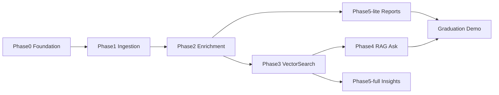

1. **Phase 0–1** — Data flowing from live scrape (primary) + Kaggle static (secondary)
2. **Phase 2** — Enrichment tags power reports
3. **Phase 5-lite** — Demo-able analysis engine **before RAG**
4. **Phase 3–4** — Explore search + Ask tab
5. **Phase 5-full** — Optional Groq narratives on report sections

---

## Phase 5-lite: Reports UI (Primary — Analysis Engine)

**Goal:** Deliver the primary product experience — detailed in-app reports without requiring vector search or RAG.

**Depends on:** Phase 2 enrichment (SQL aggregations over `enrichment_results`).

### Report Pages

| Route | Report | Data |
|-------|--------|------|
| `/reports/overview` | Overview | Totals, sentiment distribution, top themes, source breakdown |
| `/reports/pain-points` | Pain points | Ranked pain points, counts, sample quotes |
| `/reports/feature-requests` | Feature requests | Ranked requests, counts, sample quotes |
| `/reports/trends` | Trends | Sentiment/theme frequency over time |

### API Routes

| Endpoint | Purpose |
|----------|---------|
| `GET /api/reports/overview` | Overview stats + top themes |
| `GET /api/reports/pain-points` | Ranked pain points + quotes |
| `GET /api/reports/feature-requests` | Ranked feature requests + quotes |
| `GET /api/reports/trends` | Time-series sentiment/themes |

All endpoints accept query params: `source`, `sentiment`, `date_from`, `date_to`.

### Design Rules

- All counts and percentages computed in SQL — **never by LLM**
- Quotes are verbatim `content` from `feedback_items`
- Filters on every report page
- No PDF export in MVP

### Deliverables

- [ ] `lib/reports/aggregations.ts` — pure SQL report queries
- [ ] `app/reports/overview/page.tsx` (+ pain-points, feature-requests, trends)
- [ ] `app/api/reports/*` routes
- [ ] Shared nav: Reports (default) / Explore / Ask

### Exit Criteria

User opens Reports and sees filterable analysis with stats and real quotes — no question required.

---

## Phase 0: Foundation

**Goal:** Establish the project skeleton, database schema, and development environment so later phases have a stable base.

### Architecture

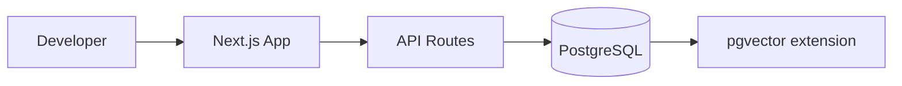

### Components

| Component | Responsibility |
|-----------|----------------|
| Next.js app | Frontend shell, API routes, shared types |
| PostgreSQL | Primary datastore for feedback and metadata |
| pgvector | Vector column support (enabled early, used in Phase 3) |
| Environment config | API keys (`GROQ_API_KEY`), `STATIC_DATASET_PATH`, DB connection |
| Groq client | Extraction only for the HTML scrape path (`lib/groq.ts`) — not a data source |
| Static import loader | Kaggle CSV import (`lib/static-import.ts`) — `STATIC_DATASET_PATH` |
| Guardrail modules | `lib/guardrails/*` — evidence gate, quote validator, source allowlist |

### Data Model (current — after migration 003)

```
feedback_items
├── id
├── ingestion_pipeline  (static_import | live_scrape; legacy huggingface retained)  ← required
├── source              (app_store | play_store | quora | twitter | forum)
├── source_id           (external dedup key)
├── source_url          (nullable; required for live_scrape)
├── product_name        (always 'Spotify')
├── title               (nullable; app/play review title)
├── content
├── rating              (nullable; 1–5)
├── author              (nullable)
├── created_at
├── ingested_at
├── fetched_at          (nullable; live_scrape only)
├── metadata            (jsonb — scrape_target_url, dataset, evidence_spans, etc.)
└── content_hash        (generated; md5(content) for dedup)

Constraints:
  UNIQUE (ingestion_pipeline, source, source_id)
  CHECK ingestion_pipeline IN ('huggingface', 'static_import', 'live_scrape')
  CHECK source IN ('app_store', 'play_store', 'quora', 'twitter', 'forum', 'huggingface')
  CHECK (ingestion_pipeline <> 'live_scrape' OR source_url IS NOT NULL)
```

### Deliverables

- [x] Next.js + TypeScript project initialized
- [x] PostgreSQL database with `feedback_items` table
- [x] pgvector extension installed
- [x] Basic health-check API route
- [ ] Optional automation (n8n or cron) for scheduled scrape
- [x] Groq API key configured; test extraction call succeeds
- [x] Static import connector (`/api/ingest/static`) ready
- [x] Guardrail stubs: `lib/allowed-sources.ts`, `lib/guardrails/evidence-gate.ts`

### Exit Criteria

App runs locally; database accepts inserts; Groq credentials validated; ingestion scripts can write Spotify reviews to the DB.

---

## Integration Modules

Dedicated integration points for Groq (HTML extraction) and the Kaggle static import. Both modules live in the Next.js backend and are callable from API routes or batch scripts.

### Groq API — Web Scraping & Extraction

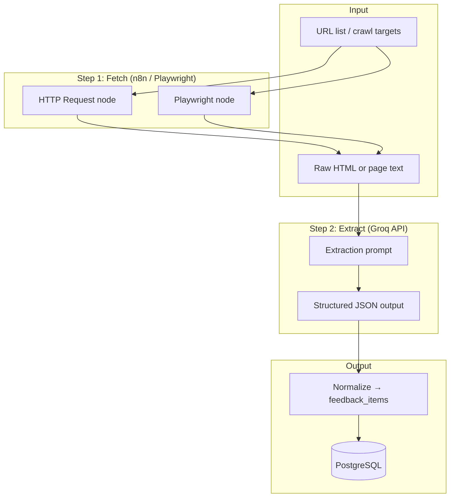

| Endpoint / module | Purpose |
|-------------------|---------|
| `lib/groq.ts` | Shared Groq client (chat completions) |
| `POST /api/scrape/extract` | Accepts raw page text/HTML; returns structured feedback records via Groq |
| `POST /api/scrape/urls` | Accepts URL list; fetches pages and runs Groq extraction (optional orchestration from n8n) |
| n8n Groq workflow | Fetch page → call `/api/scrape/extract` → write to DB |

**Groq extraction output schema:**

```json
{
  "items": [
    {
      "content": "review or comment text",
      "author": "username or null",
      "rating": 4,
      "created_at": "2024-01-15T10:00:00Z",
      "source_url": "https://...",
      "product_name": "Spotify"
    }
  ]
}
```

**Groq reuse in later phases:**

| Phase | Groq role |
|-------|-----------|
| 2 – Enrichment | Optional fast enrichment (`POST /api/enrich` via Groq) |
| 4 – RAG | Optional answer generation for lower-latency queries |
| 5 – Insights | Batch theme summarization |

**Env vars:** `GROQ_API_KEY`, `GROQ_MODEL` (default: `llama-3.3-70b-versatile`)

---

### Kaggle — Static Import Connector (Pipeline 2, secondary)

Historical Spotify reviews loaded in bulk from a Kaggle CSV. No LLM is used on import — rows map 1:1 from the file, so nothing can be hallucinated. This provides trend history and a larger sample size to contextualize the live data.

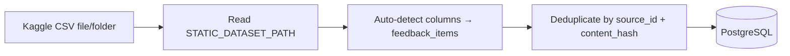

| Endpoint / module | Purpose |
|-------------------|---------|
| `lib/static-import.ts` | CSV reader + flexible column mapping + insert |
| `POST /api/ingest/static` | Trigger Kaggle CSV import |
| `GET /api/ingest/static` | Connector status, dataset path, last run |
| `npm run ingest:static` | CLI import |

**Dataset configuration:**

| Setting | Value |
|---------|-------|
| `STATIC_DATASET_PATH` | Path to the Kaggle CSV file or folder (gitignored `data/`) |
| `STATIC_DATASET_SOURCE` | Fallback `source` when the CSV has no store column (`app_store` \| `play_store`) |
| `KAGGLE_USERNAME` / `KAGGLE_KEY` | Optional, for automated CLI download |

Dataset: [alexandrakim2201/spotify-dataset](https://www.kaggle.com/datasets/alexandrakim2201/spotify-dataset).

**Column mapping (auto-detected, case-insensitive):**

| Kaggle column candidates | `feedback_items` field |
|--------------------------|------------------------|
| `review` / `content` / `text` | `content` |
| `rating` / `score` / `stars` | `rating` |
| `title` / `summary` | `title` |
| `author` / `user` / `username` | `author` |
| `time_submitted` / `date` / `timestamp` | `created_at` |
| `id` / `review_id` (else hash) | `source_id` |
| store/platform column (else `STATIC_DATASET_SOURCE`) | `source` |
| — | `ingestion_pipeline` = `static_import` |

**Deliverables (implemented):**

- [x] `lib/static-import.ts` with flexible column mapping
- [x] `POST /api/ingest/static` endpoint + `npm run ingest:static`
- [x] Import status tracking in `ingestion_runs` table
- [ ] Optional scheduled re-import (refresh of the dataset folder)

---

## Phase 1: Data Ingestion

**Goal:** Collect **Spotify app reviews only** from two pipelines and normalize into a single schema.

- **Pipeline 1 (primary) — live scrape:** Spotify reviews from the Apple App Store and Google Play Store. This is the main, continuously refreshed data source that drives the dashboard.
- **Pipeline 2 (secondary) — Kaggle static import:** historical Spotify reviews loaded in bulk to provide trend history, pattern context, and a larger sample size.

> Spotify-only: structured sources are mapped directly (no LLM). The Groq/HTML extraction path is reserved for any optional future context source and must pass grounding validation. See [guardrails.md](./guardrails.md).

### Architecture

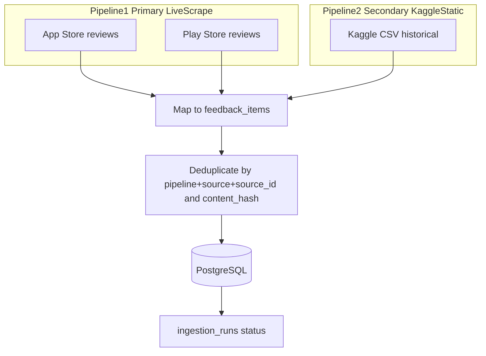

### Per-Source Mapping

| Platform | Pipeline | `source` tag | Method |
|----------|----------|--------------|--------|
| Apple App Store | 1 — live scrape (primary) | `app_store` | iTunes RSS JSON, multi-country, pages 1..10 (Apple caps ~500/country) |
| Google Play Store | 1 — live scrape (primary) | `play_store` | `google-play-scraper`, NEWEST + token pagination, multi-country |
| Kaggle Spotify dataset | 2 — static import (secondary) | `app_store` / `play_store` | CSV column mapping |
| Reddit / forums (optional) | live scrape (context) | `forum` | Reddit JSON; Spotify-filtered |
| Quora / X (optional) | live scrape (context) | `quora` / `twitter` | Groq HTML extract + grounding; skipped if blocked |

### Ingestion Requirements

- Live scrape runs on demand or scheduled; Kaggle import is a one-off/refresh baseline
- Deduplication on `(ingestion_pipeline, source, source_id)` + `content_hash`
- Error handling with per-source isolation and logging
- Source attribution + `product_name = 'Spotify'` preserved on every record

### Volume notes (free-endpoint realities)

- **Google Play** reviews are effectively a single global pool — the `country` parameter returns largely the same review IDs, so multi-country fetching collapses on dedup. Realistic unique yield via NEWEST pagination is ~5k before continuation tokens stop. Config: `play_store.countries`, `max_per_country`, `sort`, `throttle_ms`.
- **Apple App Store** RSS is genuinely per-storefront (each country ~500 max) but is frequently empty/blocked from datacenter IPs — run locally on a residential network for meaningful yield. Config: `app_store.countries`, `pages` (<=10), `throttle_ms`.
- For tens of thousands of reviews, the **Kaggle static import (Pipeline 2)** is the right lever — a single CSV can hold the full historical corpus. Live scrape keeps the data fresh.

### Deliverables (implemented)

- [x] `lib/groq.ts` — Groq client for structured extraction (HTML path)
- [x] `POST /api/scrape/extract` — Groq parsing + grounding + grounded insert
- [x] `lib/static-import.ts` + `POST /api/ingest/static` + `npm run ingest:static` (Pipeline 2)
- [x] `lib/scrape/` fetchers (App Store, Play Store, Reddit) + orchestrator
- [x] `POST /api/ingest/live` + `npm run ingest:live` (Pipeline 1)
- [x] `lib/guardrails/extraction-validator.ts` — reject ungrounded Groq output
- [x] Normalization layer mapping all sources to `feedback_items`
- [x] `ingestion_runs` table for status logging (counts, errors, last run)
- [ ] Optional scheduled automation (n8n or cron) for live scrape

### Exit Criteria

Normalized Spotify-review records in PostgreSQL from live scrape (primary) plus the Kaggle baseline (secondary), with no duplicate `(ingestion_pipeline, source, source_id)` pairs and zero ungrounded Groq extractions.

---

## Phase 2: Enrichment (Groq-free)

**Goal:** Tag every feedback item with dependable metadata for SQL reports — without bulk Groq calls.

### Architecture

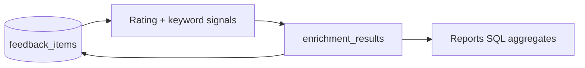

- **Sentiment:** derived from star rating when present (1–2 negative, 3 neutral, 4–5 positive; mixed when rating/text conflict). Keyword fallback when no rating.
- **Themes / pain points / feature requests:** keyword extraction (no LLM).
- **Groq is not used** in Phase 2. Run `npm run enrich` (optionally `--force` to refresh).

### Deliverables (implemented)

- [x] Rating-based sentiment + keyword themes (`lib/enrichment.ts`)
- [x] Batch job `npm run enrich`
- [x] `enrichment_results` table linked to `feedback_items`

---

## Groq usage policy

| Use Groq | Do not use Groq |
|----------|-----------------|
| RAG insight analysis (`/api/query`, Ask tab) on top **12** retrieved reviews | Live scrape / structured import |
| | Bulk enrichment of all reviews |
| | Embeddings (local Transformers.js instead) |
| | HTML page extraction (`/api/scrape/extract` — **cold/optional** only) |

---

## Phase 3: Vector Search

**Goal:** Generate embeddings and enable semantic retrieval of relevant feedback.

### Architecture

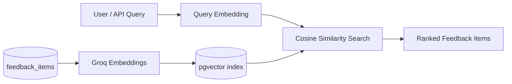

### Components

| Component | Detail |
|-----------|--------|
| Embedding model | Local `Xenova/all-MiniLM-L6-v2` via Transformers.js (`LOCAL_EMBEDDING_MODEL`) — **no Groq** |
| Storage | `embeddings` table with `vector(384)` + HNSW index (migration `004`) |
| Search API | `POST /api/search` — local query embed + pgvector cosine similarity |
| Filters | Optional filters on source, date, sentiment (from enrichment) |
| Batch | `npm run embed` backfills all rows locally |

### Embedding Strategy

- Embed the **content** field locally (384-dim, mean-pooled, normalized)
- One embedding per feedback item; first run downloads model to `.cache/transformers`
- Re-embed only when content changes

### Deliverables (implemented)

- [x] Local embedding generation (`lib/embeddings.ts`, `npm run embed`)
- [x] pgvector HNSW index on embeddings (384-dim)
- [x] Semantic search API endpoint (`POST /api/search`)
- [x] Filter support (source, date range, sentiment)
- [x] `MIN_RETRIEVAL_SCORE=0.38` default tuned for MiniLM cosine scores

### Exit Criteria

A natural-language query like *"frustrations with music recommendations"* returns relevant reviews and Reddit posts with similarity scores.

---

## Phase 4: RAG Query Interface

**Goal:** Let users ask product questions and receive structured, evidence-backed answers. **Groq is used only here** — insight analysis on the top `RAG_TOP_K` (12) retrieved reviews after a wide pool (`RAG_RETRIEVE_POOL`=40).

### Architecture

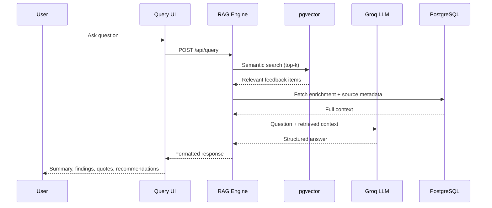

### RAG Pipeline (with guardrails)

1. **Retrieve** — embed the question; fetch top-k from PostgreSQL only (k ≈ 10–30)
2. **Evidence gate** — if items above `MIN_RETRIEVAL_SCORE` < `MIN_EVIDENCE_ITEMS`, return `insufficient_evidence` (no LLM call)
3. **Augment** — build context block from retrieved rows only; wrap in delimiters
4. **Generate** — LLM with closed-world system prompt; temperature 0
5. **Validate** — quote validator checks every quote against retrieved `content`; backend computes counts
6. **Render** — return response or `insufficient_evidence` if validation fails

See [guardrails.md](./guardrails.md) for thresholds, prompts, and blocked behaviors.

### Response Schema

```json
{
  "executive_summary": "string",
  "key_findings": ["string"],
  "supporting_quotes": [
    { "quote": "string", "theme": "string", "source": "string", "date": "string" }
  ],
  "theme_breakdown": [
    { "theme": "string", "count": 0, "sentiment": "string" }
  ],
  "source_attribution": [
    { "source": "string", "count": 0 }
  ],
  "product_recommendations": ["string"]
}
```

### Deliverables

- [ ] `lib/guardrails/evidence-gate.ts` — block RAG when retrieval insufficient
- [ ] `lib/guardrails/quote-validator.ts` — verify quotes against retrieved rows
- [ ] `POST /api/query` RAG endpoint
- [ ] Prompt template enforcing structured output
- [ ] Query UI with example questions
- [ ] Citation links back to original feedback items
- [ ] Query session logging (`query_sessions` table)

### Exit Criteria

User can ask *"Why do users struggle to discover new music?"* and receive a full structured response with real quotes and source attribution.

---

## Phase 5: Main Dashboard (primary landing)

**Goal:** A comprehensive, data-backed Spotify review analysis report **plus** a RAG bot, served at `/dashboard` as the app's main landing page. All numbers are computed in SQL; the LLM never fabricates metrics. Charts use **Recharts**. Full visual spec: [UI.md](../UI.md).

### Architecture

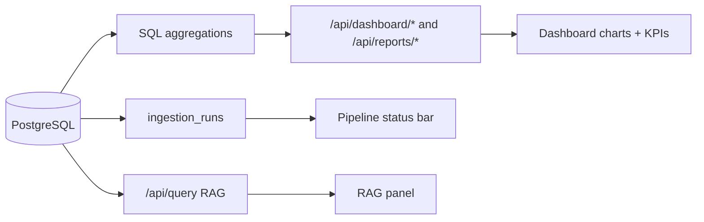

### Dashboard sections

1. **Pipeline status bar** — per-source health (App Store, Play Store = Pipeline 1 primary; Kaggle = Pipeline 2 historical): online/offline/stale dot, relative "last updated", last inserted count. Driven by latest `ingestion_runs`.
2. **Executive summary** — KPI StatCards with period deltas (total reviews + live/historical split, average rating, sentiment %, volume) and a **dynamic primary chart** (review volume / avg-rating trendline; bar fallback when sparse) with range toggles (7d/30d/90d/All). Optional grounded one-line headline.
3. **Comprehensive review metrics (Recharts):** rating distribution (bar), sentiment over time (stacked area/line), source mix (donut), top themes (horizontal bar), pain points and feature requests (ranked + bar with sample quotes), volume trend, rating trend, and **live vs Kaggle-historical** comparison to show trend shifts.
4. **RAG bot** — grounded Ask panel reusing `/api/query` (structured answer with verbatim quotes + source attribution; "insufficient evidence" state when guardrails block).

### Insight Engine (optional, Phase 5-full)

On-demand/periodic job that clusters by theme, flags rising complaints and feature requests, and writes grounded opportunity summaries — phrasing from Groq, counts from SQL.

**Deliverables (Phase 5-full):**

- [x] `lib/insights/stats.ts` — SQL snapshot + rising pain points / feature requests (current vs prior period)
- [x] `lib/insights/engine.ts` — Groq narrative on pre-computed stats (SQL fallback when Groq unavailable)
- [x] `POST /api/insights` — on-demand generation per section
- [x] `InsightPanel` on dashboard + all report pages ("Generate insights" button)

### Deliverables

- [x] `/dashboard` page set as main landing (redirect from `/`)
- [x] Pipeline status bar from `ingestion_runs`
- [x] Executive summary KPIs + dynamic Recharts chart with range toggles
- [x] Comprehensive metric charts (rating dist, sentiment-over-time, source mix, themes, pain points, feature requests, live-vs-historical)
- [x] `/api/dashboard/*` aggregation endpoints
- [x] Embedded RAG bot panel
- [x] Spotify-dark theme + components per [UI.md](../UI.md); add `recharts` dependency

### Exit Criteria

Opening `/dashboard` shows pipeline status with last-updated, an executive summary with a live trend chart, the full suite of Spotify-review metrics with visual aids, and a working grounded RAG bot — all Spotify-only and styled per UI.md.

---

## Phase 6: Extensions

**Goal:** Hybrid search and review persona segments. (PDF export and trend alerts excluded per project scope.)

### Deliverables

- [x] `005_phase6_hybrid_search.sql` — GIN tsvector index on review content
- [x] Hybrid search — full-text + semantic with reciprocal rank fusion (`lib/search.ts`)
- [x] Explore UI — Hybrid / Semantic / Keyword mode pills
- [x] Review segments — persona groupings from enrichment (`/reports/segments`, `GET /api/reports/segments`)

### Out of scope (this project)

- Downloadable reports (PDF/Markdown)
- Trend alerts / notifications
- Community forums / social media ingestion (future)

### Architecture Addition

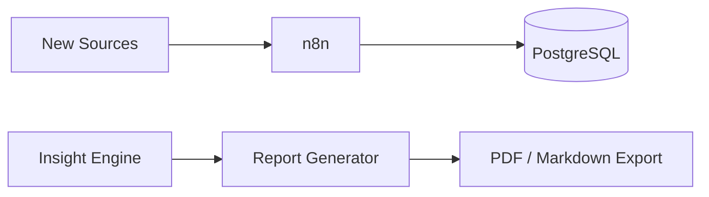

---

## Phase Dependencies

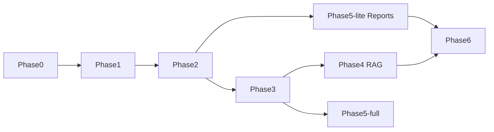

Phase 5-lite can start immediately after Phase 2 — no vector search required.

---

## Recommended Implementation Order

For a graduation project timeline, prioritize **analysis-first**:

1. **Phase 0–2** — Foundation, ingestion, enrichment
2. **Phase 5-lite** — Primary demo: in-app reports
3. **Phase 3–4** — Explore + RAG Ask tab
4. **Phase 5-full / 6** — Polish and stretch goals

The MVP satisfies [success criteria](./problemstatement.md#success-criteria): detailed reports (primary) plus evidence-backed Q&A (secondary).
