# Phase-Wise Architecture

This document defines the implementation phases for the [AI-Powered Voice of Customer Intelligence Platform](./problemstatement.md). Each phase builds on the previous one and ends with a testable milestone.

---

## High-Level Architecture

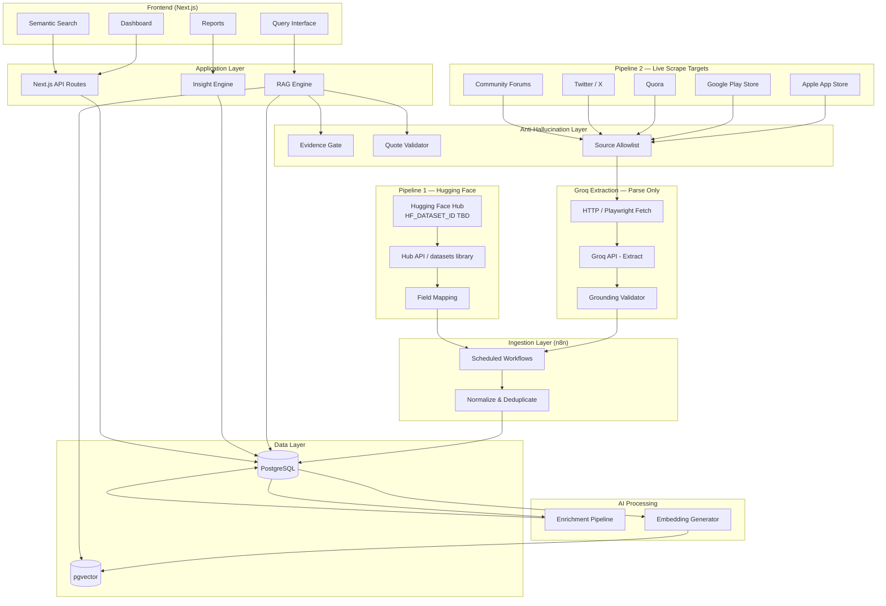

> **Data policy:** Only two ingestion pipelines are allowed — Hugging Face (`HF_DATASET_ID`) and live web scraping (App Store, Play Store, Quora, Twitter/X, forums). Full guardrail spec: [guardrails.md](./guardrails.md).

---

## Phase Summary

| Phase | Name | Goal | Key Deliverable |
|-------|------|------|-----------------|
| 0 | Foundation | Project scaffolding and data model | Running app + empty database |
| 1 | Data Ingestion | Load feedback via HF + live scrape only | Normalized feedback in PostgreSQL |
| 2 | AI Enrichment | Classify and tag every feedback item | Enriched records with metadata |
| 3 | Vector Search | Enable semantic retrieval | Working search API over embeddings |
| 4 | RAG Query Interface | Answer NL questions with evidence | End-to-end query → structured response |
| 5 | Dashboard & Insights | Visualize trends and auto-surface patterns | Interactive dashboard |
| 6 | Extensions | Reporting, hybrid search, trend alerts | PDF export, alerts (no new data pipelines) |

---

## Phase 0: Foundation

**Goal:** Establish the project skeleton, database schema, and development environment so later phases have a stable base.

### Architecture

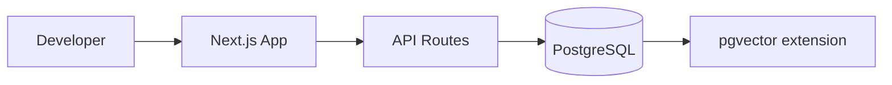

### Components

| Component | Responsibility |
|-----------|----------------|
| Next.js app | Frontend shell, API routes, shared types |
| PostgreSQL | Primary datastore for feedback and metadata |
| pgvector | Vector column support (enabled early, used in Phase 3) |
| Environment config | API keys (`GROQ_API_KEY`, `HF_TOKEN`), DB connection |
| Groq client | Extraction only for live scrape (`lib/groq.ts`) — not a data source |
| Hugging Face loader | Single-dataset import (`lib/huggingface.ts`) — `HF_DATASET_ID` TBD |
| Guardrail modules | `lib/guardrails/*` — evidence gate, quote validator, source allowlist |

### Data Model (initial)

```
feedback_items
├── id
├── ingestion_pipeline  (huggingface | live_scrape)  ← required
├── source              (app_store | play_store | quora | twitter | forum | huggingface)
├── source_id           (external dedup key)
├── source_url          (nullable; required for live_scrape)
├── product_name
├── content
├── rating              (nullable)
├── author              (nullable)
├── created_at
├── ingested_at
├── fetched_at          (nullable; live_scrape only)
└── metadata            (jsonb — raw_html, hf_dataset_id, evidence_spans, etc.)

Constraints:
  UNIQUE (ingestion_pipeline, source, source_id)
  CHECK ingestion_pipeline IN ('huggingface', 'live_scrape')
  CHECK source IN ('app_store', 'play_store', 'quora', 'twitter', 'forum', 'huggingface')
```

### Deliverables

- [ ] Next.js + TypeScript project initialized
- [ ] PostgreSQL database with `feedback_items` table
- [ ] pgvector extension installed
- [ ] Basic health-check API route
- [ ] n8n instance configured (local or cloud)
- [ ] Groq API key configured; test extraction call succeeds
- [ ] Hugging Face connector stub (`/api/ingest/huggingface`) ready
- [ ] Guardrail stubs: `lib/allowed-sources.ts`, `lib/guardrails/evidence-gate.ts`

### Exit Criteria

App runs locally; database accepts inserts; Groq and Hugging Face credentials are validated; n8n can call a webhook or write to the DB.

---

## Integration Modules

Dedicated integration points for Groq and Hugging Face. Both modules live in the Next.js backend and are callable from n8n webhooks or batch scripts.

### Groq API — Web Scraping & Extraction

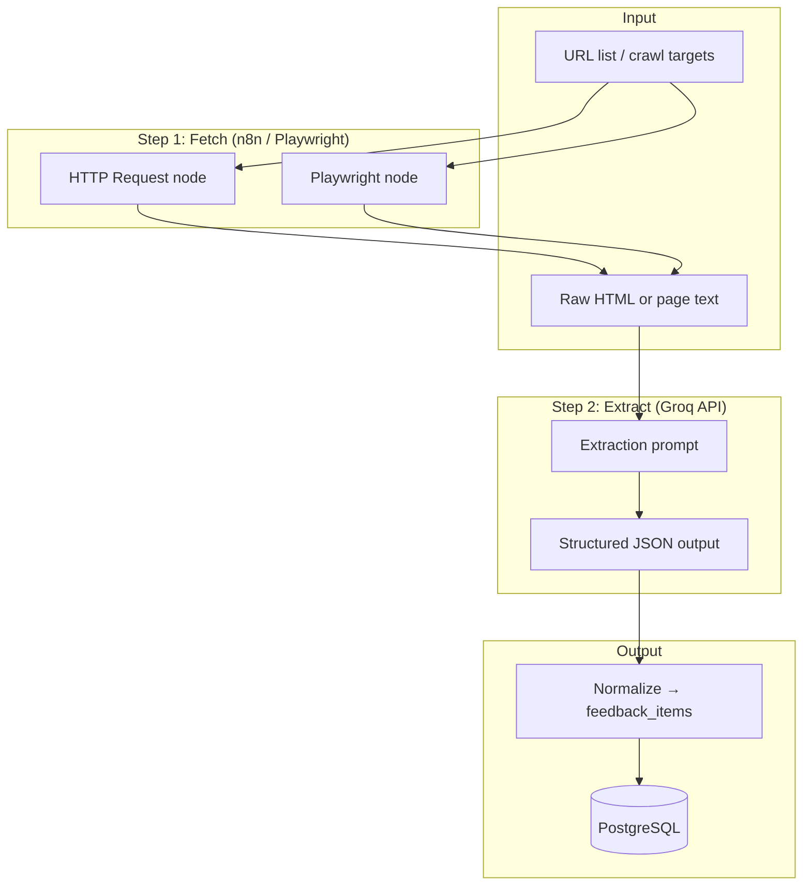

| Endpoint / module | Purpose |
|-------------------|---------|
| `lib/groq.ts` | Shared Groq client (chat completions) |
| `POST /api/scrape/extract` | Accepts raw page text/HTML; returns structured feedback records via Groq |
| `POST /api/scrape/urls` | Accepts URL list; fetches pages and runs Groq extraction (optional orchestration from n8n) |
| n8n Groq workflow | Fetch page → call `/api/scrape/extract` → write to DB |

**Groq extraction output schema:**

```json
{
  "items": [
    {
      "content": "review or comment text",
      "author": "username or null",
      "rating": 4,
      "created_at": "2024-01-15T10:00:00Z",
      "source_url": "https://...",
      "product_name": "Spotify"
    }
  ]
}
```

**Groq reuse in later phases:**

| Phase | Groq role |
|-------|-----------|
| 2 – Enrichment | Optional fast enrichment (`POST /api/enrich` via Groq) |
| 4 – RAG | Optional answer generation for lower-latency queries |
| 5 – Insights | Batch theme summarization |

**Env vars:** `GROQ_API_KEY`, `GROQ_MODEL` (default: `llama-3.3-70b-versatile`)

---

### Hugging Face — Dataset Connector

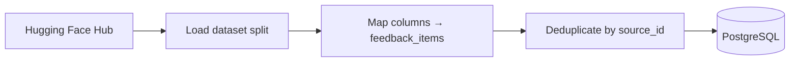

| Endpoint / module | Purpose |
|-------------------|---------|
| `lib/huggingface.ts` | Dataset loader using `datasets` or Hub HTTP API |
| `POST /api/ingest/huggingface` | Trigger import for a configured dataset |
| `GET /api/ingest/huggingface/status` | Last import run, record count, errors |
| n8n HF workflow | Scheduled call to `/api/ingest/huggingface` |

**Primary dataset configuration:**

| Setting | Example value |
|---------|---------------|
| `HF_DATASET_ID` | **TBD** — only this dataset may be imported (you will provide the ID) |
| `HF_DATASET_SPLIT` | `train` |
| `HF_TOKEN` | Optional; required for gated datasets |

**Column mapping (example — adjust to actual dataset schema):**

| HF dataset column | `feedback_items` field |
|-------------------|------------------------|
| `body` / `text` / `content` | `content` |
| `author` / `username` | `author` |
| `created_utc` / `timestamp` | `created_at` |
| `id` / `comment_id` | `source_id` |
| — | `source` = `huggingface` |
| — | `ingestion_pipeline` = `huggingface` |

**Deliverables:**

- [ ] `lib/huggingface.ts` with configurable dataset ID and field mapping
- [ ] `POST /api/ingest/huggingface` endpoint
- [ ] Import status tracking in `ingestion_runs` table
- [ ] n8n scheduled workflow for periodic re-import

---

## Phase 1: Data Ingestion

**Goal:** Automate collection from **two pipelines only** — Hugging Face dataset and live web scraping — and normalize into a single schema.

> Scraping allowlist: App Store, Play Store, Quora, Twitter/X, community forums. All Groq-extracted content must pass grounding validation. See [guardrails.md](./guardrails.md).

### Architecture

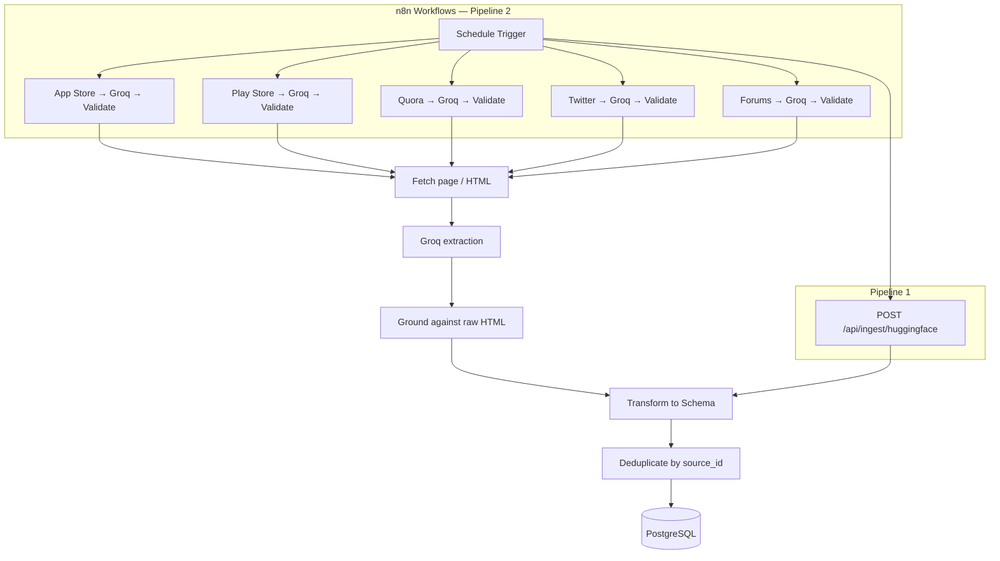

### Per-Source Workflows

| Platform | Pipeline | `source` tag |
|----------|----------|--------------|
| Hugging Face dataset | Pipeline 1 — HF connector | `huggingface` |
| Apple App Store | Pipeline 2 — live scrape | `app_store` |
| Google Play Store | Pipeline 2 — live scrape | `play_store` |
| Quora | Pipeline 2 — live scrape | `quora` |
| Twitter / X | Pipeline 2 — live scrape | `twitter` |
| Community forums | Pipeline 2 — live scrape | `forum` |

### Ingestion Requirements

- Scheduled runs (e.g., daily or weekly)
- Incremental ingestion where the source supports it
- Deduplication on `(source, source_id)`
- Error handling with retry and logging
- Source attribution preserved on every record

### Deliverables

- [ ] `lib/groq.ts` — Groq client for structured extraction
- [ ] `POST /api/scrape/extract` — Groq-powered parsing of fetched web content
- [ ] `lib/huggingface.ts` — Hugging Face dataset loader with field mapping
- [ ] `POST /api/ingest/huggingface` — bulk dataset import endpoint
- [ ] n8n workflow: App Store (fetch → Groq → DB)
- [ ] n8n workflow: Play Store (fetch → Groq → DB)
- [ ] n8n workflow: Hugging Face scheduled import
- [ ] n8n workflow: Quora (fetch → Groq → validate → DB)
- [ ] n8n workflow: Twitter/X (fetch → Groq → validate → DB)
- [ ] n8n workflow: community forums (fetch → Groq → validate → DB)
- [ ] `lib/guardrails/extraction-validator.ts` — reject ungrounded Groq output
- [ ] Normalization layer mapping all sources to `feedback_items`
- [ ] `ingestion_runs` table for status logging (counts, errors, last run)

### Exit Criteria

Thousands of normalized feedback records in PostgreSQL from Hugging Face **and** live-scraped platforms, with no duplicate `(ingestion_pipeline, source, source_id)` pairs and zero ungrounded Groq extractions.

---

## Phase 2: AI Enrichment

**Goal:** Run LLM analysis on every feedback item and persist structured metadata for search, filtering, and reporting.

### Architecture

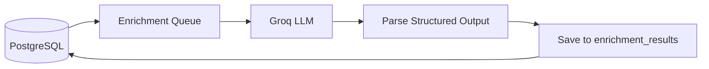

### Enrichment Pipeline

For each `feedback_item`:

1. Send content to Groq with a structured-output prompt
2. Extract and validate JSON response
3. Store results linked to the feedback item

| Field | Type | Example |
|-------|------|---------|
| sentiment | enum | positive / negative / neutral |
| themes | string[] | ["discovery", "recommendations"] |
| pain_points | string[] | ["Hard to find new artists"] |
| user_goals | string[] | ["Discover niche genres"] |
| feature_requests | string[] | ["Better playlist filters"] |
| enriched_at | timestamp | — |

### Implementation Options

| Option | When to use |
|--------|-------------|
| Batch job (cron / n8n) | Initial backfill of existing records |
| On-ingest trigger | New items enriched as they arrive |
| Next.js API background job | Simpler orchestration during development |

### Deliverables

- [ ] Enrichment prompt template with structured JSON output
- [ ] Batch enrichment job for existing data
- [ ] `enrichment_results` table linked to `feedback_items`
- [ ] Re-run / skip logic for already-enriched items

### Exit Criteria

All ingested feedback items have enrichment metadata; sentiment and themes are queryable via SQL.

---

## Phase 3: Vector Search

**Goal:** Generate embeddings and enable semantic retrieval of relevant feedback.

### Architecture

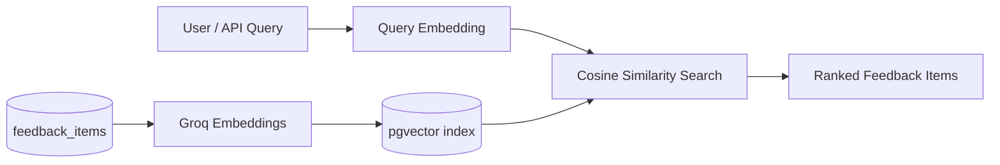

### Components

| Component | Detail |
|-----------|--------|
| Embedding model | Groq `nomic-embed-text-v1_5` (via `GROQ_EMBEDDING_MODEL`) |
| Storage | `embeddings` table with `vector(1536)` column + HNSW/IVFFlat index |
| Search API | `POST /api/search` — accepts query text, returns top-k items with scores |
| Filters | Optional filters on source, date, sentiment (from enrichment) |

### Embedding Strategy

- Embed the **content** field (optionally concatenate themes/pain_points for richer vectors)
- One embedding per feedback item
- Re-embed only when content changes

### Deliverables

- [ ] Embedding generation batch job
- [ ] pgvector index on embeddings table
- [ ] Semantic search API endpoint
- [ ] Filter support (source, date range, sentiment)

### Exit Criteria

A natural-language query like *"frustrations with music recommendations"* returns relevant reviews and Reddit posts with similarity scores.

---

## Phase 4: RAG Query Interface

**Goal:** Let users ask product questions and receive structured, evidence-backed answers.

### Architecture

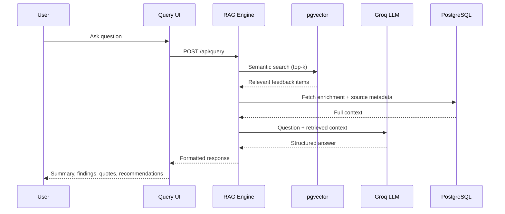

### RAG Pipeline (with guardrails)

1. **Retrieve** — embed the question; fetch top-k from PostgreSQL only (k ≈ 10–30)
2. **Evidence gate** — if items above `MIN_RETRIEVAL_SCORE` < `MIN_EVIDENCE_ITEMS`, return `insufficient_evidence` (no LLM call)
3. **Augment** — build context block from retrieved rows only; wrap in delimiters
4. **Generate** — LLM with closed-world system prompt; temperature 0
5. **Validate** — quote validator checks every quote against retrieved `content`; backend computes counts
6. **Render** — return response or `insufficient_evidence` if validation fails

See [guardrails.md](./guardrails.md) for thresholds, prompts, and blocked behaviors.

### Response Schema

```json
{
  "executive_summary": "string",
  "key_findings": ["string"],
  "supporting_quotes": [
    { "quote": "string", "theme": "string", "source": "string", "date": "string" }
  ],
  "theme_breakdown": [
    { "theme": "string", "count": 0, "sentiment": "string" }
  ],
  "source_attribution": [
    { "source": "string", "count": 0 }
  ],
  "product_recommendations": ["string"]
}
```

### Deliverables

- [ ] `lib/guardrails/evidence-gate.ts` — block RAG when retrieval insufficient
- [ ] `lib/guardrails/quote-validator.ts` — verify quotes against retrieved rows
- [ ] `POST /api/query` RAG endpoint
- [ ] Prompt template enforcing structured output
- [ ] Query UI with example questions
- [ ] Citation links back to original feedback items
- [ ] Query session logging (`query_sessions` table)

### Exit Criteria

User can ask *"Why do users struggle to discover new music?"* and receive a full structured response with real quotes and source attribution.

---

## Phase 5: Dashboard & Automated Insights

**Goal:** Provide at-a-glance visibility into feedback volume, sentiment, themes, and emerging patterns—beyond ad-hoc queries.

### Architecture

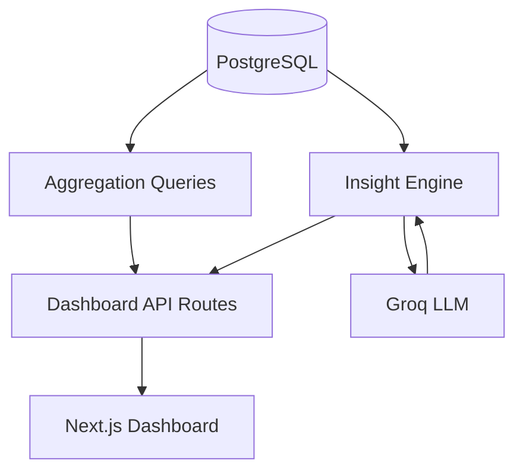

### Dashboard Views

| View | Data |
|------|------|
| **Overview** | Total feedback count, sentiment distribution, top themes |
| **Trends** | Sentiment and theme frequency over time |
| **Pain points** | Most common pain points from enrichment |
| **Feature requests** | Ranked feature requests by frequency |
| **Search** | Semantic search with filters (source, date, sentiment) |

### Insight Engine

Periodic or on-demand job that:

- Clusters feedback by theme
- Identifies recurring complaints and rising feature requests
- Flags emerging themes (frequency increase over time)
- Generates opportunity area summaries

### Deliverables

- [ ] Overview dashboard page
- [ ] Semantic search page with filters
- [ ] Theme and pain-point visualization
- [ ] Automated insight generation job
- [ ] Insights panel surfacing top opportunities

### Exit Criteria

Dashboard shows live stats from ingested data; insight engine surfaces at least recurring complaints, feature requests, and emerging themes without a manual query.

---

## Phase 6: Extensions (Future)

**Goal:** Expand sources, add reporting, and harden the platform for production use.

### Planned Extensions

| Extension | Description |
|-----------|-------------|
| Community forums | Additional n8n workflows for forum scraping |
| Social media | API-based ingestion where available |
| Downloadable reports | PDF/Markdown export of insights and query results |
| Hybrid search | Combine keyword (PostgreSQL full-text) + vector search |
| Trend alerts | Notify when a theme's frequency crosses a threshold |
| User segments | Cluster users by behavior or persona tags |

### Architecture Addition

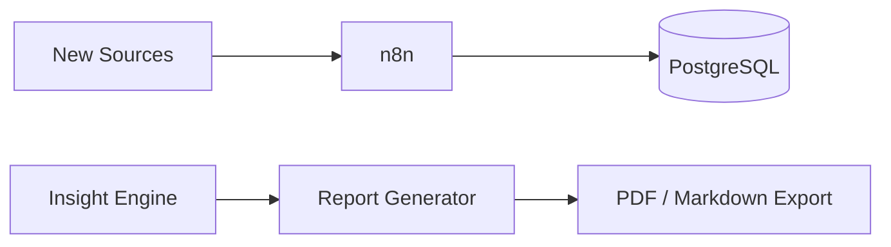

---

## Phase Dependencies

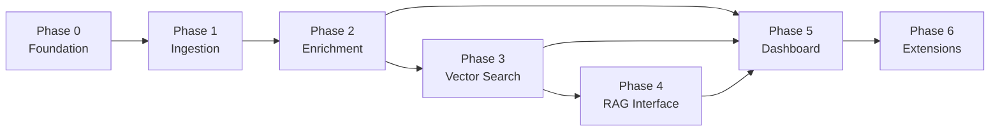

Phases 4 and 5 can partially overlap once Phase 3 is complete: dashboard views that rely on enrichment data (Phase 2) can be built in parallel with the RAG interface.

---

## Technology Mapping by Phase

| Phase | Technologies |
|-------|-------------|
| 0 | Next.js, TypeScript, PostgreSQL, pgvector, Groq + HF env config |
| 1 | n8n, **Groq API** (web extraction), **Hugging Face Hub** (dataset import) |
| 2 | Groq LLM, batch jobs / n8n |
| 3 | Groq Embeddings, pgvector HNSW index |
| 4 | RAG pipeline, Groq LLM, Next.js API + UI |
| 5 | Next.js dashboard, chart library, aggregation SQL |
| 6 | Additional n8n workflows, report generation library |

---

## Recommended Implementation Order

For a graduation project timeline, prioritize phases **0 → 4** as the core MVP:

1. **Phase 0–1** — Get real data flowing (demonstrates ingestion)
2. **Phase 2–3** — Make data searchable and intelligent (demonstrates AI pipeline)
3. **Phase 4** — Deliver the headline feature: natural-language Q&A with evidence (demonstrates RAG)
4. **Phase 5** — Add dashboard polish for presentation and evaluation
5. **Phase 6** — Stretch goals if time permits

The MVP (Phases 0–4) satisfies the [success criteria](./problemstatement.md#success-criteria): a product team member asks one question and receives a synthesized, evidence-backed answer from thousands of reviews.
