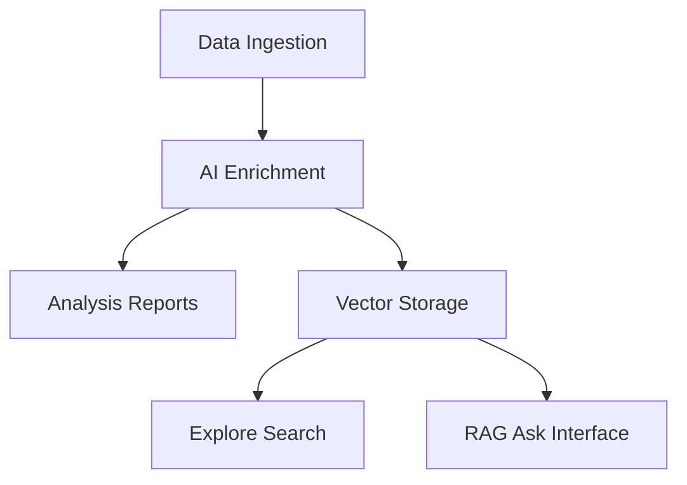
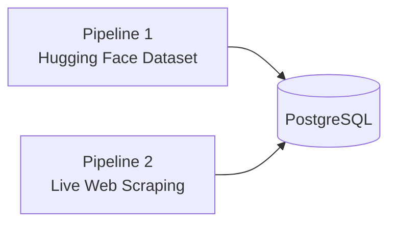

# AI-Powered Voice of Customer Intelligence Platform

## Problem Statement

Product teams depend on user feedback to understand pain points, validate ideas, and prioritize work. In practice, that feedback is fragmented across app store reviews, Reddit discussions, and other public channels—high in volume, low in structure, and difficult to synthesize by hand.

The challenge is not collecting more feedback, but **turning unstructured, multi-source input into actionable insight**. Teams need a system that aggregates feedback at scale, enriches it with AI, and surfaces insights through **detailed in-app reports** and **ad-hoc natural-language Q&A**—with evidence they can trust.

---

## Objective

Build an AI-powered web application that aggregates and analyzes large-scale user feedback to uncover:

- User pain points and frustrations
- Motivations and unmet needs
- Feature requests and emerging themes
- Product opportunities backed by real user voices

The platform has **two complementary modes** over the same ingested data:

| Mode | Priority | Purpose |
|------|----------|---------|
| **Analysis engine** | Primary | Pre-built, filterable reports in the web UI (overview, pain points, feature requests, trends) |
| **RAG interface** | Secondary | Ad-hoc questions with evidence-backed answers and citations |

Both modes draw from the same enriched feedback database and share the same [anti-hallucination guardrails](./guardrails.md).

---

## System Overview

| Stage | Purpose |
|-------|---------|
| **Ingestion** | Collect and normalize feedback from external sources |
| **Enrichment** | Classify sentiment, extract themes, pain points, and goals |
| **Analysis reports** | SQL-driven dashboards with counts, trends, and verbatim quotes |
| **Vector storage** | Embed and index content for semantic retrieval |
| **Explore** | Semantic search with filters (bridge between reports and RAG) |
| **RAG interface** | Answer natural-language questions with cited evidence |

---

## Web UI Structure

1. **Reports (default landing)** — primary analysis engine
   - Overview: volume, sentiment, top themes, source breakdown
   - Pain points: ranked complaints with sample quotes
   - Feature requests: ranked requests with evidence
   - Trends: sentiment and theme frequency over time

2. **Explore** — semantic search with source/date/sentiment filters

3. **Ask** — RAG chat for exploratory questions not covered by reports

Reports use **backend-computed statistics only** (never LLM-guessed numbers). Groq may optionally narrate pre-computed clusters in a later phase.

---

## Data Sources (Two Pipelines Only)

The platform ingests feedback through **exactly two pipelines**. No other data sources, synthetic data, or LLM-invented content is permitted. See [Anti-Hallucination Guardrails](./guardrails.md) for enforcement rules.

| Pipeline | Integration | Platforms / data |
|----------|-------------|------------------|
| **1 — Hugging Face** | Hub API / `datasets` library | Single configured dataset (`HF_DATASET_ID` — **TBD, you will provide the ID**) |
| **2 — Live scrape** | Scripts / Playwright/HTTP → Groq extraction | Apple App Store, Google Play Store, Quora, Twitter/X, community forums |

**Live-scrape targets (Pipeline 2 only):**

| Platform | `source` tag |
|----------|--------------|
| Apple App Store reviews | `app_store` |
| Google Play Store reviews | `play_store` |
| Quora | `quora` |
| Twitter / X | `twitter` |
| Community forums | `forum` |

All ingested content is normalized into a consistent schema, tagged with `ingestion_pipeline` (`huggingface` \| `live_scrape`), and validated before storage.

---

## External Integrations

### Groq API

Groq powers extraction (live scrape), enrichment, optional report narratives, RAG synthesis, and embeddings. Groq must **never invent feedback** — it only parses or summarizes stored rows. See [guardrails.md](./guardrails.md).

**Environment variables:** `GROQ_API_KEY`, `GROQ_MODEL`, `GROQ_EMBEDDING_MODEL`

### Hugging Face — Dataset Connector

Pre-built datasets loaded from Hugging Face Hub. **Primary dataset:** `HF_DATASET_ID` (**TBD**).

**Environment variables:** `HF_TOKEN` (optional), `HF_DATASET_ID`, `HF_DATASET_SPLIT`

---

## Core Capabilities

### 1. Data Ingestion

Automated collection from Hugging Face and live web scraping; normalized into PostgreSQL.

### 2. AI Enrichment

For each review or discussion: sentiment, themes, pain points, user goals, feature requests. Stored in `enrichment_results` for reports and filters.

### 3. Analysis Reports (Primary)

In-app report pages with filters (source, date, sentiment):

- Quantitative blocks computed via SQL (counts, distributions, trends)
- Evidence blocks with verbatim quotes from the database
- No PDF export in MVP — reports live entirely in the web UI

### 4. Vector Search & Explore

Semantic retrieval over embedded feedback with filters.

### 5. Retrieval-Augmented Generation (Secondary)

Natural-language Q&A with closed-world prompts, evidence gates, and quote validation. Returns `insufficient_evidence` when data is lacking — never guesses.

---

## Expected Output

### Report pages

Each report includes filterable stats, ranked themes/pain points/feature requests, source attribution, and supporting user quotes.

### RAG responses

| Section | Description |
|---------|-------------|
| **Executive summary** | Concise answer to the question |
| **Key findings** | Main insights derived from retrieved data |
| **Supporting user quotes** | Direct evidence grouped by theme |
| **Theme breakdown** | Clusters with backend-computed counts |
| **Source attribution** | Platform breakdown |
| **Product recommendations** | Actions implied by retrieved evidence |

---

## Technical Architecture

| Component | Technology |
|-----------|------------|
| Frontend | Next.js (Reports / Explore / Ask) |
| Database | PostgreSQL + pgvector |
| Web scraping & extraction | Playwright/HTTP → **Groq API** |
| Dataset import | **Hugging Face Hub** |
| Embeddings | Groq (`GROQ_EMBEDDING_MODEL`) |
| Analysis & generation | Groq API |
| Report analytics | SQL aggregations (`lib/reports/aggregations.ts`) |
| Query pattern | RAG + [guardrails](./guardrails.md) |

---

## Success Criteria

**Primary:** A user opens the Reports section and sees detailed, filterable analysis of all ingested feedback — pain points, themes, trends, quotes, and source attribution — without asking a question.

**Secondary:** A user switches to Ask and receives a guardrailed, evidence-backed answer to a natural-language question.

Both draw from ingested Hugging Face and live-scraped data only, with **no hallucinated content**.
