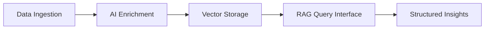
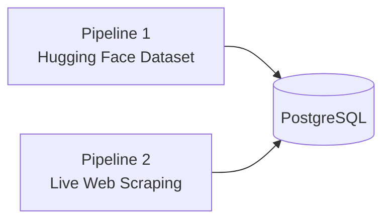
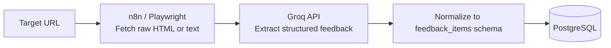
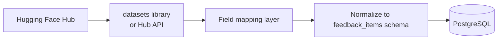

# AI-Powered Voice of Customer Intelligence Platform

## Problem Statement

Product teams depend on user feedback to understand pain points, validate ideas, and prioritize work. In practice, that feedback is fragmented across app store reviews, Reddit discussions, and other public channels—high in volume, low in structure, and difficult to synthesize by hand.

The challenge is not collecting more feedback, but **turning unstructured, multi-source input into actionable insight**. Teams need a system that aggregates feedback at scale, enriches it with AI, and answers product questions in natural language—with evidence they can trust.

---

## Objective

Build an AI-powered web application that aggregates and analyzes large-scale user feedback to uncover:

- User pain points and frustrations
- Motivations and unmet needs
- Feature requests and emerging themes
- Product opportunities backed by real user voices

The platform will ingest feedback from multiple sources, enrich each item using LLM-powered analysis, and expose insights through a **Retrieval-Augmented Generation (RAG)** query interface.

---

## System Overview

| Stage | Purpose |
|-------|---------|
| **Ingestion** | Collect and normalize feedback from external sources |
| **Enrichment** | Classify sentiment, extract themes, pain points, and goals |
| **Vector storage** | Embed and index content for semantic retrieval |
| **RAG interface** | Answer natural-language questions with cited evidence |
| **Insight generation** | Surface recurring patterns and opportunities automatically |

---

## Data Sources (Two Pipelines Only)

The platform ingests feedback through **exactly two pipelines**. No other data sources, synthetic data, or LLM-invented content is permitted. See [Anti-Hallucination Guardrails](./guardrails.md) for enforcement rules.

| Pipeline | Integration | Platforms / data |
|----------|-------------|------------------|
| **1 — Hugging Face** | Hub API / `datasets` library | Single configured dataset (`HF_DATASET_ID` — **TBD, you will provide the ID**) |
| **2 — Live scrape** | n8n + Playwright/HTTP → Groq extraction | Apple App Store, Google Play Store, Quora, Twitter/X, community forums |

**Live-scrape targets (Pipeline 2 only):**

| Platform | `source` tag |
|----------|--------------|
| Apple App Store reviews | `app_store` |
| Google Play Store reviews | `play_store` |
| Quora | `quora` |
| Twitter / X | `twitter` |
| Community forums | `forum` |

All ingested content is normalized into a consistent schema, tagged with `ingestion_pipeline` (`huggingface` \| `live_scrape`), and validated before storage. URLs outside the configured scrape allowlist are rejected.

---

## External Integrations

### Groq API — Web Scraping & Extraction

Groq provides fast LLM inference and is used as the **intelligent extraction layer** for internet-sourced feedback. Groq does not fetch pages itself; it processes raw content after a fetch step.

**Groq is responsible for (Pipeline 2 only):**

- Parsing unstructured web page content into structured fields (content, author, rating, timestamp)
- Filtering noise (navigation, ads, boilerplate) from scraped pages
- Classifying whether a page section contains user feedback vs. irrelevant content

**Groq must NOT invent data.** Every extracted item is validated against the raw fetched page before insert. Groq may also power enrichment and RAG generation, but only as a **summarizer** of stored rows — never as a data source.

**Typical flow:**

1. n8n workflow triggers on a schedule or URL list
2. HTTP Request or Playwright node fetches the raw page
3. Content is sent to Groq with an extraction prompt (structured JSON output)
4. Parsed records are deduplicated and written to PostgreSQL

**Environment variables:** `GROQ_API_KEY`, `GROQ_MODEL` (e.g. `llama-3.3-70b-versatile`)

### Hugging Face — Dataset Connector

Pre-built datasets are loaded directly from the Hugging Face Hub without manual scraping.

**Hugging Face is responsible for:**

- Bulk import of labeled feedback datasets (starting with the Spotify Reddit dataset)
- Incremental re-import when dataset revisions are published
- Mapping dataset-specific column names to the platform's normalized schema

**Primary dataset:** Configured via `HF_DATASET_ID` (**TBD — dataset ID to be provided**). Only this dataset may be imported; all other Hub datasets are blocked.

**Integration options:**

| Method | Use case |
|--------|----------|
| Python `datasets` library | One-time or scheduled batch import via script or n8n Execute Command |
| Hugging Face Hub API | Fetch dataset metadata and parquet/JSON shards over HTTP |
| n8n HTTP Request node | Call a Next.js `/api/ingest/huggingface` endpoint that wraps the loader |

**Environment variables:** `HF_TOKEN` (optional, for private or gated datasets), `HF_DATASET_ID`, `HF_DATASET_SPLIT`

---

## Core Capabilities

### 1. Data Ingestion

Automated workflows to collect feedback from configured sources, normalize fields (text, rating, timestamp, source, product), and load data into the application database.

**Implementation:** n8n ingestion workflows

### 2. AI Enrichment

For each review or discussion, the system should:

- Generate embeddings for semantic search
- Classify sentiment (positive, negative, neutral)
- Extract themes and topic labels
- Identify user pain points
- Identify user goals and motivations
- Extract feature requests

Enrichment outputs must be stored alongside the original content for filtering, reporting, and retrieval.

### 3. Vector Search

- Store embeddings in a vector-enabled database
- Support semantic retrieval of feedback relevant to a query or theme
- Return source documents as evidence for downstream analysis

### 4. Retrieval-Augmented Generation (RAG)

Users ask questions in plain language. The system:

1. Retrieves the most relevant feedback **from PostgreSQL only** (no live web fetch at query time)
2. Refuses to answer if retrieved evidence is below minimum count and similarity thresholds
3. Analyzes the retrieved set with an LLM using **closed-world prompts** (no outside knowledge)
4. Validates every quote and statistic against retrieved rows before returning
5. Returns a synthesized answer grounded in actual user quotes with source attribution

If evidence is insufficient, the bot returns an explicit `insufficient_evidence` response — **it never guesses or hallucinates**. Full rules: [guardrails.md](./guardrails.md).

### 5. Insight Generation

Beyond ad-hoc queries, the platform should automatically surface:

- Recurring complaints
- Common feature requests
- User motivations and jobs-to-be-done
- Emerging themes over time
- Product opportunity areas

---

## Example Questions

The platform should support questions such as:

- *Why do users struggle to discover new music?*
- *What are the biggest frustrations with recommendations?*
- *What unmet needs consistently appear across reviews?*
- *What listening behaviors are users trying to achieve?*
- *Which user segments face different discovery challenges?*
- *What product opportunities emerge from user feedback?*

---

## Expected Output

Every query response should follow a consistent structure:

| Section | Description |
|---------|-------------|
| **Executive summary** | Concise answer to the question |
| **Key findings** | Main insights derived from the data |
| **Supporting user quotes** | Direct evidence grouped by theme |
| **Theme breakdown** | How feedback clusters around topics |
| **Source attribution** | Which platforms and items support each finding |
| **Product recommendations** | Suggested actions or opportunity areas |

---

## Technical Architecture

| Component | Technology |
|-----------|------------|
| Frontend | Next.js |
| Database | PostgreSQL + pgvector |
| Web scraping & extraction | n8n + Playwright/HTTP → **Groq API** |
| Dataset import | **Hugging Face Hub** (`datasets` library or API) |
| Embeddings | Groq embedding models (`GROQ_EMBEDDING_MODEL`) |
| Analysis & generation | Groq API |
| Query pattern | Retrieval-Augmented Generation (RAG) + [guardrails](./guardrails.md) |
| Workflow orchestration | n8n |

---

## Anti-Hallucination Guardrails (Summary)

| Stage | Guardrail |
|-------|-----------|
| **Ingestion** | Two pipelines only (HF + live scrape); Groq output grounded against raw HTML; allowlisted domains |
| **Enrichment** | Extract labels from stored text only; temperature 0 |
| **Retrieval** | Search ingested DB only; minimum similarity threshold |
| **RAG** | No answer without ≥ 3 qualifying retrieved items; quotes validated; counts computed in backend |
| **Blocked** | Inventing reviews, quotes, stats, or recommendations; querying the internet at answer time |

See [guardrails.md](./guardrails.md) for the full specification and implementation checklist.

---

## Success Criteria

A product team member should be able to ask a single natural-language question and receive a synthesized, evidence-backed answer drawn **only** from ingested Hugging Face dataset rows and live-scraped App Store, Play Store, Quora, Twitter, and forum feedback — without manually reading each source item.

The platform succeeds when it reliably transforms this data into **actionable product insights** while **never hallucinating** content that is not in the database.
