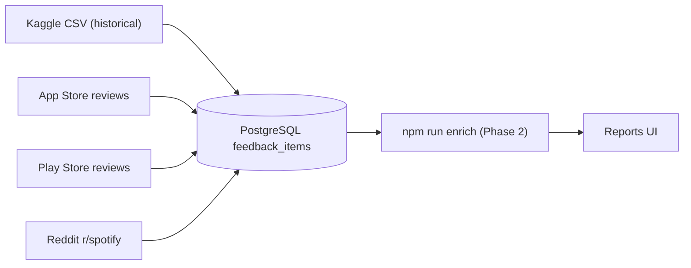

# Learning Log — Voice of Customer Platform

This file records what was done at each step, why it was done, and what we learned. Updated after each major prompt or troubleshooting session.

---

## Step 1 — Kaggle dataset setup and `.env.local`

**What we did**

- Created [`.env.local`](.env.local) from [`.env.example`](.env.example) with placeholders for:
  - `GROQ_API_KEY` — Groq LLM for enrichment and Ask
  - `DATABASE_URL` — PostgreSQL connection string
  - `STATIC_DATASET_PATH` — path to the Kaggle CSV after unzip
  - `KAGGLE_USERNAME` / `KAGGLE_KEY` — optional, for Kaggle CLI downloads
- Updated [`.env.example`](.env.example) with the same Kaggle variables (HF vars kept until migration).
- Added `data/` and `*.zip` to [`.gitignore`](.gitignore) so large datasets are not committed.

**Why**

The app needs secrets locally (API keys) and a path to the static Kaggle CSV. `.env.local` is git-ignored so keys never go to GitHub.

**How to add Kaggle data to Cursor**

Cursor reads files in your project folder — you do not upload the zip to chat.

1. Download [alexandrakim2201/spotify-dataset](https://www.kaggle.com/datasets/alexandrakim2201/spotify-dataset).
2. Unzip into `data/spotify-dataset/` (or your chosen folder, e.g. `documents/DATASET.csv`).
3. Set `STATIC_DATASET_PATH` in `.env.local` to the **full path including the `.csv` filename**.

**Note:** Static import code (`npm run import:static`) is planned but not fully wired yet; the env var prepares for that.

---

## Step 2 — localhost returned 404

**What happened**

Opening `http://localhost:3000` returned **404** for `/api/health` and reports.

**Why**

Another app was already using **port 3000**. Next.js started this project on **port 3001** instead:

```text
Port 3000 is in use by process 7000, using available port 3001 instead.
```

Port 3000 ≠ this VoC app. The user asked **not** to kill existing processes.

**What we changed**

- [`package.json`](package.json): `"dev": "next dev -p 3001"` — always use 3001.
- [`.env.local`](.env.local): `NEXT_PUBLIC_APP_URL=http://localhost:3001`.

**Correct URLs**

| Page | URL |
|------|-----|
| App (redirects to reports) | http://localhost:3001 |
| Health check | http://localhost:3001/api/health |
| Reports | http://localhost:3001/reports/overview |

---

## Step 3 — “Application error” (Digest: 1796734002)

**What happened**

After fixing the port, the page showed:

```text
Application error: a server-side exception has occurred while loading localhost
Digest: 1796734002
```

**Why**

Server logs showed `ECONNREFUSED` when querying PostgreSQL. The Next.js app runs fine, but **Reports** need a database. Nothing was listening on `localhost:5432`.

Flow:

```text
Browser → http://localhost:3001/
       → redirect to /reports/overview
       → SQL query via lib/reports/aggregations.ts
       → getPool().query(...) → ECONNREFUSED
       → 500 / Application error
```

**What we added**

- [`app/error.tsx`](app/error.tsx) and [`app/reports/error.tsx`](app/reports/error.tsx) — friendlier message when the DB is down, with setup steps.

**Also fixed**

- Removed accidental **space after `=`** in `GROQ_API_KEY=` (spaces break env parsing).

---

## Step 4 — Why Docker?

**Question:** Why do we need Docker?

**Answer:** Docker is **not** required for the Next.js UI. It is only the **convenient way this repo starts PostgreSQL** (with the **pgvector** extension) and optional **n8n**.

The app stores feedback, enrichment, and embeddings in Postgres. Without a running database on the URL in `DATABASE_URL`, every report page fails.

**Alternatives to Docker**

- Cloud Postgres (Neon, Supabase, etc.) + set `DATABASE_URL` + `npm run db:migrate`
- Local Postgres 16 + pgvector extension installed manually

---

## Step 5 — Docker open but app still fails (current)

**What you reported**

Docker Desktop was opened, setup commands were run, page reloaded — still not working.

**What we verified (automated check)**

```bash
npm run db:migrate
# → ECONNREFUSED on 127.0.0.1:5432 and ::1:5432
```

So **PostgreSQL is still not accepting connections** on port 5432. Opening Docker Desktop alone is not enough — the **postgres container must be running**.

**Common reasons**

| Symptom | Cause |
|---------|--------|
| ECONNREFUSED on 5432 | Container not started, or `docker compose up` failed |
| Docker open, no containers | User opened the app but did not run `docker compose up -d` |
| `docker: command not found` | Docker CLI not on PATH — use Docker Desktop terminal or install CLI |
| Container exits immediately | Port conflict, bad volume, or image pull failed — check container logs |
| App works but empty reports | DB up but migrations/seed not run |

**Diagnostic command (added this step)**

```bash
npm run db:check
```

This tests port 5432, DB login, pgvector, and row count — and prints specific next steps.

**Exact sequence to run (project folder)**

```bash
cd "/Users/aparna/Graduation Project"
docker compose up -d postgres
docker compose ps
npm run db:check
npm run db:migrate
npm run db:seed-demo
npm run dev
```

Then open **http://localhost:3001/reports/overview** (not 3000).

**How to confirm Docker worked**

In Docker Desktop → **Containers**, you should see **`voc-postgres`** with status **Running**.  
Or in terminal: `docker compose ps` → `voc-postgres` → `running`.

If `voc-postgres` is missing or **Exited**, click it in Docker Desktop and read **Logs**, or run:

```bash
docker compose logs postgres
```

**After DB is up**

Restart `npm run dev` once (Ctrl+C, then `npm run dev` again) so the app picks up a healthy connection.

---

## Quick reference

| Component | How it runs | Required? |
|-----------|-------------|-----------|
| Next.js UI | `npm run dev` → port **3001** | Yes |
| PostgreSQL | `docker compose up -d postgres` or cloud DB | Yes |
| Migrations | `npm run db:migrate` | Yes (first time) |
| Demo data | `npm run db:seed-demo` | Recommended for UI |
| Groq API | `GROQ_API_KEY` in `.env.local` | For enrichment / Ask |
| Kaggle CSV | `STATIC_DATASET_PATH` | For static import (when implemented) |
| n8n | `docker compose up -d` (full stack) | Optional |

---

*Last updated: Step 5 — Docker open but Postgres still not reachable on 5432; added `npm run db:check` and verification checklist.*

---

## Step 6 — No `voc-postgres` container in Docker Desktop

**What you reported**

Docker Desktop showed **no container named `voc-postgres`**.

**Why that is normal before first setup**

`voc-postgres` is **not pre-installed**. It is **created the first time** you run:

```bash
docker compose up -d postgres
```

from the project folder ([`docker-compose.yml`](docker-compose.yml) sets `container_name: voc-postgres`). Opening Docker Desktop alone only starts the Docker engine — it does not create project containers.

**What we found on your Mac**

- Docker Desktop is installed at **`~/Applications/Docker.app`** (not the default `/Applications/Docker.app`).
- The `docker` command was **not on your shell PATH**, so `docker compose` from a normal terminal may have failed silently or never run.
- Before this step, `docker compose ps` showed **zero containers**.

**What we did**

1. Started Postgres with Docker on PATH:
   ```bash
   export PATH="$HOME/Applications/Docker.app/Contents/Resources/bin:$PATH"
   cd "/Users/aparna/Graduation Project"
   docker compose up -d postgres
   ```
2. Container **`voc-postgres`** created and status **healthy** on port 5432.
3. Fixed migration error in [`db/migrations/001_init.sql`](db/migrations/001_init.sql) — `sha256()` generated column was rejected by PostgreSQL 16 (`generation expression is not immutable`); switched to `md5(content)`.
4. Ran `npm run db:migrate` and `npm run db:seed-demo` (10 demo rows).
5. Added [`scripts/start-db.sh`](scripts/start-db.sh) and npm script **`npm run db:start`** — handles Docker path on your Mac automatically.

**Easier command for next time**

```bash
npm run db:start
npm run db:migrate    # first time only (or after new migrations)
npm run db:seed-demo  # optional demo data
npm run db:check      # verify everything
```

**You should now see in Docker Desktop**

- Container: **`voc-postgres`**
- Image: `pgvector/pgvector:pg16`
- Status: **Running**
- Port: `5432:5432`

**App URL**

http://localhost:3001/reports/overview — verified **HTTP 200** with 10 seeded feedback items.

**If `docker` is still “not found” in your terminal**

Either use **`npm run db:start`**, or add Docker to PATH permanently in `~/.zshrc`:

```bash
export PATH="$HOME/Applications/Docker.app/Contents/Resources/bin:$PATH"
```

---

*Last updated: Step 6 — Created voc-postgres, fixed migration, seeded DB; app reports page returns 200.*

---

## Step 7 — Built Phase 1: Data Ingestion (Kaggle + live scrape)

**Goal:** Implement Phase 1 from `docs/phase-wise-architecture.md` — two ingestion pipelines feeding `feedback_items`.

**Decisions (confirmed with you)**

- **Pipeline 1** = Kaggle static import (replaces the Hugging Face stub).
- **Pipeline 2** = live scrape of feasible sources now: **App Store, Play Store, Reddit (forum)**. Quora and X are gracefully skipped (no public API / anti-bot).

### What two "pipelines" means



### Schema change — migration 003

[`db/migrations/003_phase1_ingestion.sql`](db/migrations/003_phase1_ingestion.sql):
- Added `static_import` to the allowed `ingestion_pipeline` values (kept `huggingface` so old rows stay valid).
- Added a `title` column (App/Play reviews have a title separate from the body).

### Pipeline 1 — Kaggle static import (no LLM)

- [`lib/static-import.ts`](lib/static-import.ts) — reads the CSV at `STATIC_DATASET_PATH` (file or folder), auto-detects columns (review/rating/title/date/author), and inserts rows. Empty rows skipped; duplicates dropped by the unique constraint.
- [`app/api/ingest/static/route.ts`](app/api/ingest/static/route.ts) — `GET` status, `POST` to import.
- Run it: **`npm run ingest:static`**
- **Verified:** a 4-row sample CSV imported as 3 rows (1 empty skipped).

### Pipeline 2 — live scrape

- [`config/scrape-targets.spotify.json`](config/scrape-targets.spotify.json) — Spotify app IDs, subreddit, and which sources are enabled.
- [`lib/scrape/fetch.ts`](lib/scrape/fetch.ts) — fetch helper with user-agent + timeout.
- Source fetchers under [`lib/scrape/sources/`](lib/scrape/sources/):
  - `app-store.ts` — Apple iTunes RSS JSON (no API key).
  - `play-store.ts` — `google-play-scraper` package.
  - `reddit.ts` — public Reddit `.json` listing.
- [`lib/scrape/ingest.ts`](lib/scrape/ingest.ts) — orchestrator: fetch → map → insert (live_scrape) → record an `ingestion_runs` row per source. Each source is wrapped in try/catch so one failure does not stop the others.
- [`app/api/scrape/extract/route.ts`](app/api/scrape/extract/route.ts) — for HTML sources that need LLM parsing: Groq extracts, the grounding validator rejects anything not in the page, and grounded items are inserted.
- Run it: **`npm run ingest:live`** (or `npm run ingest:live -- --only=play_store`)
- **Verified:** **100 real Spotify Play Store reviews** ingested end-to-end.

### Anti-hallucination (why this is safe)

- Kaggle and App/Play/Reddit are mapped **directly** from structured data — no LLM invents anything.
- The Groq HTML path only keeps quotes that pass `validateExtractionGrounding` against the raw page.
- Dedup on `(ingestion_pipeline, source, source_id)` + `content_hash`.

### Environment note (important)

From this build environment (a datacenter IP), **App Store RSS returned 0 reviews and Reddit returned HTTP 403** — both are IP/anti-bot blocks, not code bugs. **Play Store worked.** On your home/residential connection, App Store and Reddit should also return data. If a source is blocked, the run logs it and continues.

### New npm scripts

```bash
npm run ingest:static          # Pipeline 1 — Kaggle CSV
npm run ingest:live            # Pipeline 2 — all enabled sources
npm run ingest:live -- --only=play_store,forum
npm run enrich                 # Phase 2 — sentiment/themes for new rows
```

### How to use it (your steps)

1. Put the Kaggle CSV at the path in `STATIC_DATASET_PATH` (currently `documents/DATASET.csv`).
2. `npm run ingest:static`
3. `npm run ingest:live`  (run locally for App Store + Reddit to work)
4. `npm run enrich`  → then open Reports at http://localhost:3001/reports/overview

### Removed

- `lib/huggingface.ts` and `app/api/ingest/huggingface/route.ts` (replaced by static import). Health route and seed scripts updated accordingly.

**Verification:** `npm run build` passes; migration 003 applied; ingestion smoke tests green (Kaggle 3 inserted, Play Store 100 inserted, `ingestion_runs` recorded per source).

---

## Step 8 — Phase 2: AI Enrichment (built + run)

**Goal:** tag every feedback item with sentiment, themes, pain points, user goals, and feature requests so Reports/RAG have structured metadata.

**What already existed (code-complete from earlier scaffolding):**
- `db/migrations/002_enrichment_and_query.sql` — `enrichment_results` table (1:1 with `feedback_items`, GIN indexes on arrays).
- `lib/enrichment.ts` — `enrichContentWithGroq` (JSON-mode, temp 0), `enrichContentHeuristic` (offline fallback), `enrichFeedbackItem` (skip/empty/force logic), `enrichBatch`, `countEnrichedItems`.
- `app/api/enrich/route.ts` (POST batch, GET count) and `scripts/enrich.ts` (`npm run enrich`).

**What I changed this step:**
- Hardened `ENRICHMENT_SYSTEM_PROMPT` (`lib/guardrails/prompts.ts`): explicit JSON schema, controlled snake_case theme vocabulary, concise grounded phrases, `[]` when absent, no fabrication.

**How I ran it:**
```bash
npm run db:check          # confirmed Postgres up, 110 feedback rows
npm run db:migrate        # 001/002/003 idempotent
npm run enrich -- --limit=200
```
(Scripts use `tsx`, which needs an IPC pipe the sandbox blocks — run them outside the sandbox.)

**Result — exit criteria met:**
- 110 feedback_items → 110 enrichment_results (0 unenriched, 0 failed).
- 93 `completed`; 17 `skipped_empty` (deleted/`[removed]`/too-short).
- Sentiment: 44 negative, 38 positive, 8 mixed, 3 neutral (completed only).
- Top themes: ui_ux 18, ads 18, pricing 13, music/performance/playback 9, discovery 8.
- `/api/enrich` → `{"enriched_count":93}`; `/api/reports/overview` returns sentiment split, source breakdown, and top themes.

**Re-run notes:** `npm run enrich` skips already-`completed` rows; add `--force` to re-enrich all. New rows from future ingestion are picked up automatically.

---

*Last updated: Step 8 — Phase 2 enrichment built and run; 110/110 items enriched (93 completed, 17 skipped_empty, 0 failed), queryable via SQL and Reports API.*

---

## Step 9 — Scale live ingestion (Pipeline 1)

**Why:** the first live run only produced ~100 reviews. Root cause: only Google Play returned data, and `config` requested `num: 100`. The store's "60k" is total star ratings, not text reviews available via free endpoints.

**What I changed:**
- `config/scrape-targets.spotify.json` — multi-country + caps: `play_store.countries` (10 English storefronts), `max_per_country: 5000`, `sort: "newest"`, `throttle_ms`; `app_store.countries`, `pages: 10`, `throttle_ms`.
- `lib/scrape/types.ts` — new multi-country config shape (back-compat fields kept).
- `lib/scrape/sources/play-store.ts` — deep pagination via `nextPaginationToken` + `sort.NEWEST`, per-country loop, throttle, `metadata.country`.
- `lib/scrape/sources/app-store.ts` — per-country loop, pages 1..10, throttle, continue-past-failure, `metadata.country`.
- `lib/scrape/ingest.ts` + `lib/scrape/fetch.ts` — `sleep` helper, progress logging per country and per 1k inserted.
- `lib/enrichment.ts` — bounded-concurrency worker pool in `enrichBatch` + exponential backoff on Groq 429s; `scripts/enrich.ts` gains `--concurrency=`.

**Results:**
- `npm run ingest:live -- --only=play_store`: fetched 51,000, **inserted 5,012 unique** (skipped 45,988 dups).
- `npm run ingest:live -- --only=app_store`: only `ca` returned data (50); other storefronts empty/blocked from this datacenter IP.
- DB now: **5,172 feedback items** (play_store 5,114, app_store 52, + earlier demo rows). Up from 110.

**Key findings (free-endpoint realities):**
1. **Google Play `country` is not a separate pool** — it returns largely the same global review IDs, so multi-country collapses on dedup. Realistic unique yield ~5k via NEWEST pagination before tokens stop.
2. **Apple App Store** RSS is genuinely per-storefront (~500/country) but is empty/blocked from datacenter IPs — needs a residential network (run locally) for real yield.
3. **For tens of thousands, use the Kaggle static import (Pipeline 2)** — a single CSV holds the full historical corpus; live scrape keeps it fresh.
4. **Groq enrichment is rate-limited** (~30 req/min free tier) — concurrency above ~2-3 just produces 429s. Enriching ~5k items has a hard floor of ~2-3 hours; added backoff so it is eventually-complete, and re-runs pick up any `failed`/unenriched rows. For a fast full pass, the heuristic fallback (no API) can tag everything instantly.

**How to run:**
```bash
npm run ingest:live -- --only=play_store     # ~5k unique, ~5 min
npm run ingest:live -- --only=app_store      # run locally for real yield
npm run enrich -- --limit=6000 --concurrency=2   # grinds within Groq rate limits
```

---

*Last updated: Step 9 — live ingestion scaled to ~5.2k reviews; documented Google Play global-pool dedup, App Store datacenter-IP blocking, and Groq rate-limit ceiling; enrichment running in background with backoff.*

---

## Step 10 — Groq-light architecture (insights only)

**Goal:** Stop using Groq for data fetching (bulk enrichment, embeddings, HTML scrape). Groq only for on-demand insight analysis over retrieved evidence; live scrape stays main; aggregates from star ratings.

**What changed:**
- **Phase 2:** Rating-based sentiment (1–2 negative, 3 neutral, 4–5 positive + mixed when text conflicts) + keyword themes. No bulk Groq. `npm run enrich -- --force` re-tagged all rows in ~4s.
- **Phase 3:** Local embeddings via `@xenova/transformers` (`Xenova/all-MiniLM-L6-v2`, 384-dim). Migration `004_local_embeddings.sql`. `npm run embed` backfilled 5,172 vectors in ~52s. No Groq API for vectors.
- **Phase 4:** RAG retrieves pool of 40, passes top **12** to Groq (`RAG_TOP_K`). `MIN_RETRIEVAL_SCORE` lowered to **0.38** for MiniLM cosine scores.
- **Cold:** `POST /api/scrape/extract` documented as optional Groq HTML path only.

**Results:**
- Sentiment distribution now rating-driven: 43% positive, 30% negative, 25% neutral (was ~72% neutral under heuristic).
- Semantic search works: `"frustrations with music recommendations"` returns relevant Play Store reviews with scores.
- Ask/RAG works: grounded Groq answer with verbatim quotes from <=12 items.
- Groq API calls only happen when you use `/ask` or `/api/query`.

**Commands:**
```bash
npm run enrich          # after new ingestion (Groq-free)
npm run embed           # after new ingestion (local, ~1 min per 5k)
```

---

*Last updated: Step 10 — Groq-light architecture built; local embeddings + rating enrichment; Groq insights-only at k=12.*

---

## Step 11 — Phase 5 Main Dashboard

**Goal:** Single landing page at `/dashboard` with pipeline status, SQL-driven KPIs, Recharts charts, and embedded RAG — per [UI.md](../UI.md) §9 and [phase-wise-architecture.md](docs/phase-wise-architecture.md) Phase 5.

**What changed:**
- **`recharts`** dependency + [lib/types/dashboard.ts](lib/types/dashboard.ts), [lib/dashboard/aggregations.ts](lib/dashboard/aggregations.ts) — pipeline status, KPI deltas, rating/volume trends, live vs historical.
- **API:** `GET /api/dashboard/status`, `/summary`, `/metrics` (range + report filters).
- **UI:** [app/dashboard/page.tsx](app/dashboard/page.tsx), dashboard components (`PipelineStatusBar`, `ExecutiveSummary`, `DashboardMetricsGrid`, `ChartCard`).
- **RAG:** [app/components/RagPanel.tsx](app/components/RagPanel.tsx) shared by `/ask` and dashboard (compact mode).
- **Nav:** `/` → `/dashboard`; sidebar lists Dashboard first.

**Verification:**
- `npm run build` passes.
- APIs return pipeline status + KPI summary for ~5.1k reviews.

**How to view:**
```bash
npm run dev   # http://localhost:3001/dashboard
```

---

*Last updated: Step 11 — Phase 5 dashboard shipped at /dashboard with Recharts, pipeline bar, KPIs, metrics grid, embedded RAG.*

---

## Step 12 — Phase 5-full Insight Engine

**Goal:** Groq narratives on pre-computed SQL stats — rising complaints, feature requests, and product opportunities. Counts from SQL only; Groq phrasing only.

**What changed:**
- [lib/insights/stats.ts](lib/insights/stats.ts) — period comparison, rising pain points / feature requests, stats snapshot.
- [lib/insights/engine.ts](lib/insights/engine.ts) — `generateInsights()` with Groq + SQL fallback.
- `POST /api/insights` — sections: `dashboard`, `overview`, `pain-points`, `feature-requests`, `trends`.
- [app/components/InsightPanel.tsx](app/components/InsightPanel.tsx) — "Generate insights" on dashboard + all report pages.

**Usage:** Click **Generate insights** on `/dashboard` or any `/reports/*` page. Respects active filters and dashboard range.

---

*Last updated: Step 12 — Phase 5-full Insight Engine shipped.*

---

## Step 13 — Phase 6 Extensions (hybrid search + segments)

**Goal:** Hybrid keyword + semantic search on Explore; review persona segments report. Excluded: PDF export, trend alerts.

**What changed:**
- Migration `005_phase6_hybrid_search.sql` — `content_tsv` GIN index for PostgreSQL full-text.
- [lib/search.ts](lib/search.ts) — `fullTextSearch`, `hybridSearch` (RRF fusion), `search()` with `mode`: hybrid | semantic | keyword.
- [app/explore/page.tsx](app/explore/page.tsx) — mode pills, combined score badges.
- [lib/segments/aggregations.ts](lib/segments/aggregations.ts) + `/reports/segments` — 9 persona buckets from enrichment tags.

**Try it:**
- Explore → Hybrid search (default)
- Reports → Segments

---

*Last updated: Step 13 — Phase 6 hybrid search + review segments.*

---

## Step 14 — Kaggle / historical dataset (Pipeline 2)

**Goal:** Populate live vs historical dashboard charts with ~52k Kaggle reviews.

**What changed:**
- `npm run dataset:download` — fetches `DATASET.csv` via Hugging Face mirror (or Kaggle API if credentials set).
- Saved to `data/spotify-dataset/DATASET.csv` (~52,702 rows).
- `.env.local` → `STATIC_DATASET_PATH=data/spotify-dataset/DATASET.csv`

**Finish import (requires Postgres running):**
```bash
docker compose up -d postgres
npm run ingest:static   # ~5–15 min for 52k rows
npm run enrich
npm run embed
```

